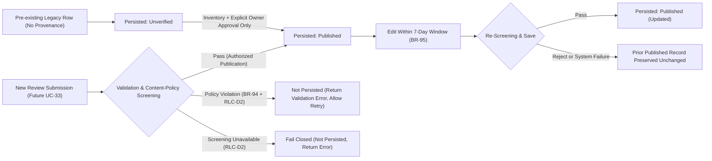

# TM-70 — Review Lifecycle Minimal Clarification & Rating Eligibility Contract

## Document Control

| Field | Value |
|---|---|
| Status | **OWNER-APPROVED DESIGN DIRECTION — PENDING INDEPENDENT DOCUMENT REVIEW** |
| Document Author | Implementation Agent (`ANTI`) |
| Date | 2026-10-08 (Remediation Round 2: 2026-10-09) |
| Task | TM-70 — [UC-24] Search Tours (Checkpoint 0: Review Lifecycle & Rating Eligibility) |
| Primary Authority | `Report3_Software-Requirement-Specification-V2.docx` |
| Frozen TM-70 Docs Baseline | `a923a5f3222c572a7fa4eefa82e696a55e554638` |
| Supplemented TM-70 Files | `requirements/tm-70-uc24-search-tours-v2-addendum.md`, `requirements/tm-70-uc24-implementation-plan.md` |
| Owner Decision Source | ChatGPT project conversation on `2026-10-08` (see §3.1) |
| Decisions Accepted in Source Conversation | `RLC-D1` through `RLC-D7` |
| External Provenance Verification | **`PENDING`** — Original ChatGPT conversation is external to the repository and not independently accessible to Codex; requires an attached decision excerpt or explicit owner sign-off record in the repository/PR/ticket |
| Cross-Module POI Rollout Gate | **`OPEN / UNRESOLVED RELEASE GATE`** — POI compatibility ownership is `UNASSIGNED` (see §5, §6.4, §12.3, §15) |
| Backend Branch Divergence Gate | **`UNRESOLVED`** — `feature/datmnt-complete-tour-search-backend` is `ahead 2, behind 17` vs. `origin/develop` (`0075fcb991652f0e6949243d51b5b80ededd0599`) |
| Checkpoint Execution Mode | **DOCS-ONLY** — No Backend, SQL, POI, Web, or Mobile code has been modified or executed; all test cases in §13 are planned specifications for the future authorized Backend checkpoint |
| Applies To | Backend (`social.Reviews`, `Review` domain/persistence, UC-24 rating aggregation/filter/sort, and cross-module `Review` aggregate release gating) |

---

## 1. Canonical Authority

`Report3_Software-Requirement-Specification-V2.docx` is the primary requirement
authority for TripMate.

This document records the owner-approved minimal Review publication lifecycle
direction (`RLC-D1` through `RLC-D7`) needed to specify TM-70 UC-24 Search
Tours rating aggregation, `minimumRating` filtering, and `rating` / `relevance`
tie-break sorting truthfully.

This document is a supplemental engineering clarification. It is **not** a
replacement for `Report3_Software-Requirement-Specification-V2.docx`, does not
rewrite Report 3 V2, and does not modify the frozen TM-70 UC-24 contract files.
Neither old Report 3 (V1) nor pre-existing incomplete implementation code may
override Report 3 V2.

---

## 2. Frozen TM-70 Baseline Reference

- **Frozen Docs Commit SHA:** `a923a5f3222c572a7fa4eefa82e696a55e554638`
  (`docs(tm-70): freeze UC-24 V2 search contract`)
- **Frozen Files Preserved Byte-for-Byte Unchanged:**
  - `requirements/tm-70-uc24-search-tours-v2-addendum.md` (blob
    `3645a6a5c8f1aa5bf8c6b177b8614b8c755cdb94`, including owner decisions
    `D1–D9` and `AC-01` through `AC-37`)
  - `requirements/tm-70-uc24-implementation-plan.md` (blob
    `6dcff1ca39ab3493aba7ef11149226fe3134bc91`, including Phases 0–7)

In the frozen addendum (§9 "Rating", `AC-19` through `AC-24`), UC-24 requires:
- `aggregateRating` to be the arithmetic mean of eligible published/visible Tour
  reviews on a `1.0..5.0` scale;
- `minimumRating` filtering to use the unrounded mean (`>= minimumRating`) and
  exclude unrated Tours;
- API/display projection to round `aggregateRating` to one decimal place, or
  return `null` when a Tour has no eligible review;
- Review eligibility to follow the canonical published/visible lifecycle rules
  of the Review domain.

Because `social.Reviews` and `TripMate.Domain.Entities.Review` currently store
ratings without a persisted publication status column, `RLC-D1` through `RLC-D7`
define the minimal persistence, factory, migration, and eligibility rules to be
implemented when Phase 1 Task 1.3 and Phase 2 Task 2.6 of the frozen
implementation plan are authorized.

---

## 3. Owner Decision Provenance & Approved Decisions (`RLC-D1` through `RLC-D7`)

### 3.1 Approval Provenance & Verification Status

To maintain strict auditability, approval provenance is separated into the
following explicit records:

1. **Actual Owner Confirmation (ChatGPT Conversation):**
   - Confirmation date: `2026-10-08`.
   - In the project ChatGPT conversation, the owner confirmed the proposed
     minimal Review lifecycle direction with the statement:
     > "chốt theo hướng bạn đề xuất và hãy đưa prompt cho tôi, anti thì thực hiện còn codex và bạn sẽ xử lí luồng review đầy đủ và chi tiết cùng với việc xét có lệch scope hay không"
2. **Decisions Presented and Accepted in That Conversation:**
   - The minimal direction accepted by the owner consists of the seven decisions
     `RLC-D1` through `RLC-D7` recorded in §3.2 below. These supplement and
     remain distinct from the original TM-70 search decisions (`D1–D9`).
3. **Document Author:**
   - Drafted by Implementation Agent (`ANTI`) based on the owner-confirmed
     prompt instructions and read-only repository inspection.
4. **Review Status:**
   - `OWNER-APPROVED DESIGN DIRECTION — PENDING INDEPENDENT DOCUMENT REVIEW` (by
     Codex).
5. **Missing Formal Approval Evidence & External Provenance Verification:**
   - **In-Repository Independent Evidence Status:** **`PENDING`**.
   - Because the original ChatGPT project conversation is external to the Git
     repository and is not independently accessible to the Codex review agent,
     this document does **not** represent the external conversation as
     independently verified in-repo evidence.
   - No owner signatures, Jira approval transitions, external sign-off links, or
     unverified timestamps have been invented.
   - **Action Requested for Governance Closure:** Attach a verbatim decision
     excerpt or record an explicit owner sign-off comment in the repository, PR,
     or Jira ticket so independent reviewers can verify provenance directly from
     project artifacts.

### 3.2 Approved Decisions (`RLC-D1` through `RLC-D7`)

#### RLC-D1 — Persist Review publication status
- Publication states `Published` and `Unverified` are persisted on the canonical
  `Review` model.
- `Unverified` is for legacy publication-unknown records whose publication
  provenance and content-policy compliance cannot be proven.
- `Unverified` does **not** mean content-policy rejection.

#### RLC-D2 — Policy-rejected content non-persistence & pre-publication screening
- Policy-rejected Review content is **not** persisted.
- New content may be `Published` only after successful content-policy screening
  and domain validation.
- Failed screening must not change existing `Published` content.
- **If screening rejects content:**
  - Do not persist the rejected content (ordered by `RLC-D2`).
  - Do not publish the Review (mandated by Report 3 V2 §3.7.2 `BR-94`, Abnormal
    Case `7.a1`, `PC-02`).
  - Return the V2-defined validation response and permit user correction and
    retry.
- **If screening is unavailable:**
  - Fail closed.
  - Do not publish unverified content.
  - Preserve existing `Published` content unchanged during failed edits.
- Do **not** implement a fake, no-op, or hardcoded screening service.

#### RLC-D3 — Deferral of Report Review, Hide/Unhide, and Staff moderation
- Report Review, Hide/Unhide, `Hidden` status, Staff Review moderation,
  review-reporting APIs, and moderator workflows/dashboards are **DEFERRED**.

#### RLC-D4 — Deferral of Review deletion functionality
- Review deletion functionality is **DEFERRED**.
- No hard-delete or soft-delete policy has been approved.
- No deletion columns (`IsDeleted`, `DeletedAt`) or deletion endpoints may be
  introduced in this checkpoint or in TM-70.

#### RLC-D5 — Confirmed Published eligibility for Aggregate Rating
- Only confirmed `Published` Reviews contribute to `AggregateRating`.
- Use a shared eligibility predicate respecting target type and ID
  (`TargetType` and `TargetId`).
- Unrounded arithmetic mean is used for filtering (`minimumRating`).
- When no eligible `Published` Review exists for a target, `AggregateRating`
  evaluates to `null`.
- Shared eligibility behavior must remain consistent across UC-24, UC-26, and
  all public `Review` aggregate consumers in the canonical Review domain.

#### RLC-D6 — Legacy Review provenance and guarded migration policy
- Legacy Reviews without verified publication provenance remain `Unverified`
  until an approved inventory and backfill are completed.
- Never blanket-promote legacy rows to `Published`.
- Use an additive, guarded SQL migration strategy when schema changes are
  executed in an authorized Backend checkpoint.
- Explicit data inventory and owner-approved mapping are required before any
  publication backfill.

#### RLC-D7 — Future UC-33 edit-window and publication preservation invariants
- Successful authorized edits within the edit window preserve `Published`.
- Rejected or failed edits retain the previous `Published` content unchanged
  (never destroying, corrupting, or unpublishing the prior valid `Published`
  Review).
- The canonical seven-day edit-window requirement (Report 3 V2 §3.7.2 `BR-95`)
  remains in force.
- Do **not** implement the full UC-33 (`Submit Trip Review`) workflow in this
  checkpoint or as part of TM-70.

---

## 4. Review Publication Lifecycle & Domain Factory Invariants

### 4.1 Canonical state set

| State | Code / SQL literal | Meaning | Included in `AggregateRating`? | Visible in public review lists? |
|---|---|---|---:|---:|
| **Published** | `'Published'` | Review has satisfied V2 eligibility and content-policy screening through an authorized publication operation (or is an explicitly constructed test fixture / owner-approved backfill record). | **Yes** | **Yes** |
| **Unverified** | `'Unverified'` | A persisted legacy `Review` whose publication provenance cannot be established from existing trustworthy data (reserved for existing legacy data, including records identified during a controlled pre-cutover inventory). | **No** | **No** |

**Narrow definition of `Unverified` (`RLC-D1`, `RLC-D2`, `RLC-D6`):**
`Unverified` is reserved strictly for existing legacy data (including records
identified during a controlled pre-cutover inventory) whose publication
provenance cannot be established from existing trustworthy data. It is **NOT**:
- a normal state for new `Review` submissions;
- a queue for pending content-policy screening;
- a substitute for successful screening;
- a way to persist policy-rejected content;
- an authorization to publish a `Review`;
- a moderation workflow state; or
- a default production creation state.

### 4.2 Lifecycle transition rules



For future `UC-33` creation and edit workflows (not authorized for implementation
during TM-70):
1. **Validation and pre-publication screening (`BR-94` vs. `RLC-D2`):**
   - Validate all applicable domain inputs and booking/author authorization.
   - Execute the approved content-policy screening.
   - Only successfully screened and validated content may enter the authorized
     publication path (`Published`).
   - **Report 3 V2 §3.7.2 (`BR-94`, Abnormal Case `7.a1`, `PC-02`)** requires
     that written review content be screened against the content policy and that
     policy-violating content **must not be Published** (returning a validation
     error so the Traveler can edit and retry).
   - **Owner Decision `RLC-D2`** specifies that policy-rejected Review content
     **must not be persisted** at all (neither as `Unverified` nor in a separate
     rejected state).
2. **Fail-closed screening (`RLC-D2`):** If the content-policy screening
   dependency fails, times out, or is unavailable during new submission or edit,
   the operation must fail closed and must neither insert an `Unverified` row
   nor mutate an existing `Published` row.
3. **Edit preservation (`BR-95`, `RLC-D2`, `RLC-D7`):** During the 7-day edit
   window (`BR-95`), failed or rejected edits preserve the previously
   `Published` content unchanged.

### 4.3 Review Factory and Screening Boundary Invariant

To prevent unscreened content from ever being persisted or treated as
`Published` in production, the `Review` domain entity must enforce the following
invariant when implemented:

1. **Authorized publication transition only:** A `Review` may enter or
   transition to `Published` **only** through an authorized publication
   operation that has verified the required domain validation and content-policy
   screening (`RLC-D2`).
2. **No default-to-`Published` and no unrestricted `Unverified` default on
   creation paths:** Do **not** create or authorize a production factory default
   (`Review.Create(...)`, `Review.CreatePoiReview(...)`, or any general entity
   constructor) that marks unscreened `Review` content as `Published`, and do
   **not** use `Unverified` as an unrestricted default to persist arbitrary new
   unscreened `Review` submissions.
3. **No screening bypass via `Review.Create`:** Calling `Review.Create` or
   `Review.CreatePoiReview` does not constitute content-policy screening and
   must not bypass screening requirements. Existing `Review` creation paths
   remain subject to a separately authorized `Review`-domain implementation
   checkpoint.
4. **ORM persistence is not publication approval:** EF Core entity materialization,
   change-tracker attachment, or SQL row insertion cannot be treated as proof of
   publication approval.
5. **Explicit test-only arrangement for `Published` fixtures:** Automated unit
   and integration tests that require `Published` reviews to test rating
   aggregation, filtering, or sorting must use an explicit test-only arrangement
   or controlled test fixture helper—never by weakening production publication
   invariants or making `Review.Create` auto-publish.
6. **No fake screening service & no UC-33 implementation in TM-70:** No fake,
   no-op, or hardcoded content-policy screening implementation is authorized
   (`RLC-D2`), and the full `UC-33` review submission workflow is not
   implemented in TM-70 (`RLC-D7`).

---

## 5. Legacy Migration, Mixed-Version Deployment Compatibility, and Rollback Safety Policy

Because `social.Reviews` is a polymorphic table shared across Tour and POI
consumers, any future schema migration and rollout must obey the repository's
Database-First SQL rules (`database/README.md`), `RLC-D6`, and the deployment
safety contract below. **No actual migration or deployment is authorized in this
Checkpoint 0 session.**

### 5.1 Additive Schema Migration (`A`)

When the schema change is implemented in a subsequent authorized Backend
checkpoint:
1. **Additive, guarded migration strategy:**
   - Update `database/tripmate_schema_v7.sql` and add an idempotent,
     transactional SQL migration under `database/migrations/` (never use
     `dotnet ef migrations`).
   - Add `publication_status VARCHAR(16)` to `social.Reviews`.
2. **Preservation of existing records and `Unverified` classification (`RLC-D6`):**
   - Do **not** destroy or mutate existing `Review` content, ratings, target
     references, timestamps, or primary-key identifiers (`review_id`).
   - During the controlled pre-cutover upgrade of an existing database where
     `publication_status` is newly added, classify pre-existing legacy rows
     (`WHERE publication_status IS NULL`) as `publication_status = 'Unverified'`,
     because legacy rows carry no proof of content-policy screening.
   - **Never** blanket-promote legacy rows to `'Published'` in a migration.
3. **Constraint enforcement (without unrestricted `Unverified` write defaults):**
   - After classifying pre-existing legacy rows as `'Unverified'`, alter
     `publication_status` to `VARCHAR(16) NOT NULL` and enforce a named check
     constraint:
     `CK_Reviews_PublicationStatus CHECK (publication_status IN ('Published', 'Unverified'))`.
   - Do **not** use a permanent database default constraint to silently persist
     new unscreened application writes as `'Unverified'` or `'Published'`;
     every post-cutover insert must supply its explicit, invariant-checked
     publication status.
   - Roll back the migration transaction with `THROW` if a same-name column,
     constraint, or index exists with an incompatible shape.

### 5.2 Old/New Application Compatibility: Schema vs. Business-Semantic Compatibility (`B`)

Deployment planning must explicitly distinguish **structural (schema)
compatibility** from **business-semantic compatibility**: an additive column may
be structurally compatible with older SQL `SELECT` queries while an unupdated
rating consumer or writer remains **semantically incompatible** under `RLC-D1`,
`RLC-D2`, and `RLC-D5`. Mixed-version deployment must **not** become a loophole
that permits new unscreened `Review` submissions to be persisted.

| Scenario | Structural / Schema Compatibility | Business-Semantic Compatibility (`RLC-D1`, `RLC-D2`, `RLC-D5`, `RLC-D6`) | Required Mitigation & Compatibility Gate |
|---|---|---|---|
| **1. Old application code reading/writing the new schema** | **Read-compatible** for `SELECT` queries that do not reference `publication_status`; **Write-incompatible** once `publication_status NOT NULL` is enforced without an unsafe default. | **Incompatible:** Old readers omit `PublicationStatus == 'Published'` and would aggregate `'Unverified'` rows; any old writer that cannot satisfy the `RLC-D2` screening/publication invariant must not be allowed to persist unscreened reviews as `'Unverified'` or `'Published'`. | **Deployment / Write-Path Compatibility Gate:** Do not silently permit unsafe writes for compatibility. Any pre-cutover writer unable to satisfy the new publication invariant must be upgraded or blocked before cutover, and consumer upgrades must be coordinated (§5.3). |
| **2. New application code reading legacy `Review` rows** | **Compatible** once the additive migration has added `publication_status` and classified legacy rows as `'Unverified'`. | **Compatible for updated consumers:** Updated queries filter `PublicationStatus == 'Published'`, excluding `'Unverified'` legacy rows until an approved inventory/backfill promotes verified records (`RLC-D6`). | Apply additive schema migration before deploying new application binaries that query `publication_status`. |
| **3. Existing POI aggregates that do not filter status (`ExplorePois`, `GetPoiDetail`, `GetPoiRecommendations`)** | **Structurally compatible** (queries still execute against `social.Reviews`). | **Semantically incompatible:** Unupdated POI handlers aggregate all `TargetType == 'POI'` rows regardless of `publication_status`, violating `RLC-D5` if `'Unverified'` POI rows exist. | Block production rollout via the Cross-Module POI Release Gate (§6.4) until POI consumers are approved and updated. |
| **4. Tour aggregates using `Published`-only eligibility (`UC-24`, `UC-26`)** | **Compatible** with the new schema. | **Semantically compliant:** Only confirmed `'Published'` Tour reviews contribute to `AggregateRating`; Tours with only `'Unverified'` reviews evaluate to `null`. | Verify during the authorized Backend checkpoint using planned Tests `R-1..R-9` (§13). |
| **5. Mixed deployments during application upgrades** | **Structurally compatible for reads** if the additive SQL migration runs first. | **Semantically inconsistent** during any window where old and new replicas—or updated Tour handlers and unupdated POI handlers—run concurrently over `'Unverified'` rows, or if any legacy writer were active. | Enforce the gated deployment ordering in §5.3 so all public `Review` consumers and any write paths enforce the shared invariants together. |

### 5.3 Safe Deployment Ordering Gates (`C`)

Before `Review` publication metadata or legacy data classification/backfill can
be rolled out to a shared environment, the following seven gates must be
satisfied in order:

1. **Gate 1 — Validate additive schema compatibility:** Prove in isolated SQL
   Server tests that the additive migration upgrades pre-existing schemas
   non-destructively, classifies legacy rows as `'Unverified'`, enforces
   constraints, and is idempotent.
2. **Gate 2 — Inventory all shared `Review` consumers:** Identify every query,
   projection, and test across the Backend that reads or writes `social.Reviews`
   (`Tour`, `POI`, `'RouteSegment'`, `'Operator'`).
3. **Gate 3 — Prepare and test shared eligibility behavior:** Define the shared
   `Published`-only eligibility predicate (`TargetType`, `TargetId`,
   `PublicationStatus == 'Published'`) and prepare the required query and test
   fixture updates across all impacted consumers.
4. **Gate 4 — Obtain cross-module approval for POI changes:** Secure explicit
   owner approval and task ownership for updating `ExplorePoisQueryHandler`,
   `GetPoiDetailQueryHandler`, `GetPoiRecommendationsQueryHandler`, and their
   test suites.
5. **Gate 5 — Coordinate deployment of impacted Tour and POI consumers:** Deploy
   the updated Tour and POI aggregate consumers together with the additive
   schema so no public endpoint exposes inconsistent `Review` eligibility
   semantics.
6. **Gate 6 — Verify `Published`-only aggregation across modules:** Execute both
   Tour and POI SQL Server regression test suites and confirm that no
   `'Unverified'` Review contributes to any public rating aggregate or review
   count.
7. **Gate 7 — Perform approved legacy classification/backfill only after
   prerequisites:** Execute any promotion of verified legacy rows from
   `'Unverified'` to `'Published'` only after a row-level inventory, explicit
   owner mapping sign-off (`RLC-D6`), and Gates 1–6 are complete.

> **Governance Status Notice:** An exact production deployment procedure is
> **not** claimed as already approved. Production rollout remains **blocked**
> (`OPEN RELEASE GATE`) while POI compatibility ownership is **`UNASSIGNED`**
> and while Backend branch divergence (`ahead 2, behind 17` vs.
> `origin/develop`) remains unresolved.

### 5.4 Rollback and Recovery Contract (`D`)

1. **Rollback before data classification:**
   - Because the upgrade migration must be wrapped in `BEGIN TRAN ... COMMIT`
     with `BEGIN CATCH ... IF @@TRANCOUNT > 0 ROLLBACK TRAN; THROW; END CATCH`,
     any failure before commit rolls back atomically, leaving pre-existing
     `social.Reviews` rows untouched.
2. **Rollback after publication metadata is populated:**
   - Once `publication_status` has been populated (with `'Unverified'` legacy
     classifications, new `'Published'` reviews, or owner-approved backfill
     decisions), rolling back application code or dropping the column carries
     material integrity risks.
3. **Risks of old application code ignoring `publication_status`:**
   - Rolling back application binaries to a version that ignores
     `publication_status` causes queries to include `'Unverified'` rows in
     public aggregates, breaching `RLC-D5` and `RLC-D6`.
4. **Prohibition on `DROP COLUMN` as a default rollback:**
   - Executing `ALTER TABLE social.Reviews DROP COLUMN publication_status`
     permanently destroys recorded publication provenance (erasing the
     distinction between screened `'Published'` reviews and `'Unverified'`
     legacy records). **`DROP COLUMN` must not be treated or used as a default
     safe rollback.**
5. **Preference for controlled roll-forward:**
   - When a defect is discovered after publication metadata is populated and a
     destructive rollback would lose provenance or expose unverified ratings,
     the required recovery strategy is a **controlled roll-forward** (deploying
     a targeted query/application fix while keeping `publication_status` intact)
     or temporarily gating the affected endpoint until fixed.
6. **Preservation of lifecycle metadata & post-recovery revalidation:**
   - Every recovery action must preserve `social.Reviews.publication_status`
     values and existing review identifiers/content, followed by revalidation of
     both Tour and POI aggregate behavior before declaring recovery complete.

---

## 6. Eligible-Review Rating Predicate, Frozen Search Contract Alignment, and Cross-Module Gate

### 6.1 Shared eligibility predicate definition

For any rated subject identified by `(targetType, targetId)`, a `Review` row is
**eligible** to contribute to `AggregateRating` if and only if all three
conditions hold (`RLC-D5`):

```text
review.TargetType == targetType
AND review.TargetId == targetId
AND review.PublicationStatus == 'Published'
```

For UC-24 Tour Search and UC-26 Tour Detail, `targetType` is `'Tour'`
(`Review.TargetTypeTour`) and `targetId` is `tour.Id` (`commerce.Tours.tour_id`).

### 6.2 Aggregation, filtering, and sorting semantics

| Operation | Rule | Null / Boundary Behavior |
|---|---|---|
| **Eligible set** | `r.target_type = 'Tour' AND r.target_id = t.tour_id AND r.publication_status = 'Published'` | Rows with `publication_status = 'Unverified'`, `target_type <> 'Tour'`, or `target_id <> t.tour_id` are excluded. |
| **Unrounded mean** | `AVG(CAST(r.rating AS DECIMAL(10, 4)))` over the eligible set | Evaluates to `NULL` when the eligible set is empty. |
| **`minimumRating` filter** | Inclusive predicate: `unroundedMean >= @minimumRating` (`1.0..5.0`) | When `@minimumRating` is supplied, Tours with `unroundedMean IS NULL` are excluded (`AC-19`, `AC-20`). When omitted, unrated Tours remain eligible. |
| **Response projection (`aggregateRating`)** | Rounded to one decimal place (Frozen Addendum §9, `AC-21`). Exact midpoint tie-breaking is an **`UNRESOLVED IMPLEMENTATION DETAIL`** requiring a separate approved clarification before midpoint-specific API expectations are locked. | Serialized as a one-decimal number or `null` when unrated (`AC-21`, `AC-34`). Never `0` or `0.0`. |
| **`rating` sort** | `unroundedMean DESC` (or consistent aggregate order), unrated (`NULL`) last, then `Title ASC, TourId ASC` | Tours with only `Unverified` reviews are unrated (`NULL`) and sort last (`AC-24`). |
| **`relevance` sort tie-break** | Within the same keyword match class: `AggregateRating DESC` with `NULL` last, then `Title ASC, TourId ASC` | Uses the same eligible `Published` aggregate (`AC-22`). |

### 6.3 Frozen Search Tours Discoverability, Exact Sort Values, and Logical Query Pipeline

To remain 100% consistent with `requirements/tm-70-uc24-search-tours-v2-addendum.md`,
the Tour Search query pipeline must preserve the frozen discoverability,
representative-schedule, availability, and sorting contracts without alteration.

#### 6.3.1 Tour Discoverability and Schedule Semantics (Frozen Addendum §2, §6, §12)

The outer Tour eligibility boundary establishes Tours that are
**Administrator-approved**, **publicly published** (`BR-56`, `AC-03`), and
otherwise eligible under the frozen tour visibility and schedule rules in the
frozen addendum.

Discoverability in `GET /api/v1/tours` **must NOT require**:
- positive remaining capacity;
- an upcoming schedule in every case;
- current bookability (`bookable = true`); or
- at least one available slot.

The following frozen behaviors from `requirements/tm-70-uc24-search-tours-v2-addendum.md`
(§6 and §12) are preserved unchanged:
- **A. Sold-out schedules remain discoverable:** A sold-out search-discoverable
  schedule participates in filtering and representative selection with
  `availabilityStatus = soldOut` and `remainingSlots = 0` (`AC-11`, `AC-30`).
- **B. Eligible public Tours without an upcoming schedule:** When no explicit
  departure-date criterion is supplied, an approved and publicly published Tour
  without an upcoming search-discoverable schedule may still appear in results
  with `representativeScheduleId = null`, `departureAtUtc = null`,
  `availabilityStatus = noUpcomingSchedule`, and `remainingSlots = null`
  (Addendum §6.2 item 4, §12.1).
- **C. Explicit past date criteria:** When an explicit past date criterion
  (`startDate`, `endDate`, or both in `Asia/Ho_Chi_Minh`) is supplied,
  qualifying past (`departureAtUtc < asOfUtc`) or `Completed`
  search-discoverable schedules may satisfy that search criterion and be
  selected as the representative schedule; the Tour remains visible and allows
  Detail navigation while booking is disabled (`bookable = false`) and its
  underlying capacity status (`available` or `soldOut`) is preserved without
  being forcibly converted to `soldOut` (`AC-09..AC-11`, `AC-30`).
- **D. Cancelled and administratively disabled schedules:** Cancelled or
  administratively disabled schedules are never search-discoverable and never
  participate in date filtering, representative-schedule selection, or
  `departureDate` sorting (Addendum §6.1, `AC-09..AC-11`, `AC-25`).
- **E. Discoverability vs. bookability:** Tour discoverability in search is not
  equivalent to bookability.
- **F. Availability vs. booking eligibility:** `availabilityStatus`
  (`available`, `soldOut`, `noUpcomingSchedule`, `unknown`) describes
  representative-schedule capacity status and remains distinct from booking
  eligibility (`AC-30`).
- **G. Representative schedule selection and tie-breaking:** Representative
  schedule selection uses the single request-level `asOfUtc` snapshot and
  deterministic ordering `departureAtUtc ASC, scheduleId ASC` (selecting the
  earliest matching search-discoverable schedule when a date criterion exists,
  or the nearest upcoming search-discoverable schedule with
  `departureAtUtc >= asOfUtc` when no date criterion exists; Addendum §6.1–§6.2).
- **H. No invented visibility rules:** No new Tour or Schedule visibility rules
  are introduced by this clarification.

#### 6.3.2 Exact Supported Public Sort Values (Frozen Addendum §4.1, §10)

The supported public `sort` query parameter values for `GET /api/v1/tours` are
**EXACTLY**:

```text
relevance
priceAsc
priceDesc
rating
departureDate
```

No other sort values are permitted. All frozen default-sort rules, `relevance`
precedence rules, and deterministic tie-breakers (owner decision `D8`, Addendum
§5 and §10, `AC-22..AC-27`) remain unchanged:
- **Defaults:** `relevance` when a non-empty normalized `keyword` is present;
  `departureDate` when `keyword` is omitted/empty; `sort=relevance` with an
  empty normalized `keyword` falls back to `departureDate` (`AC-26`, `AC-27`).
- **`relevance`:** Best match class per token, Tour classified by its worst
  matched token class (`exact Title` $\rightarrow$ `Title prefix` $\rightarrow$
  `Title token/substring` $\rightarrow$ `Destination` $\rightarrow$
  `Operator Name`); within the same class: `AggregateRating DESC` (`null` last),
  then `Title ASC, TourId ASC` (`AC-22`).
- **`priceAsc` / `priceDesc`:** `BasePrice ASC` (or `DESC`), then
  `Title ASC, TourId ASC` (`AC-23`).
- **`rating`:** Eligible `Published` `AggregateRating DESC` with unrated
  (`null`) last, then `Title ASC, TourId ASC` (`AC-24`).
- **`departureDate`:** Selected representative schedule `departureAtUtc ASC`
  (selected via `departureAtUtc ASC, scheduleId ASC` against the request-level
  `asOfUtc` snapshot), missing representative schedule last, then
  `Title ASC, TourId ASC` (`AC-25`).

#### 6.3.3 Logical Query Processing Order

The logical query processing order for `GET /api/v1/tours` is:

1. **Establish approved and publicly published Tours** (`BR-56`, `AC-03`,
   following the frozen discoverability rules in §6.3.1).
2. **Apply applicable non-rating search predicates**, including departure-date
   schedule semantics (`startDate` / `endDate` in `Asia/Ho_Chi_Minh`),
   `keyword`, `destination`, `minPrice` / `maxPrice` (against `basePrice`),
   `durationDays`, and `category` **exactly as defined by the frozen addendum**.
3. **Compute eligible `Published` Review aggregates**
   (`TargetType == 'Tour' && TargetId == tour.Id && PublicationStatus == 'Published'`)
   for the relevant candidate Tour set.
4. **Apply `minimumRating`** using unrounded aggregate values
   (`unroundedMean >= minimumRating`, excluding unrated `NULL` Tours when
   `minimumRating` is supplied).
5. **Apply the supported frozen sorting option** (`relevance`, `priceAsc`,
   `priceDesc`, `rating`, or `departureDate`) **and all approved deterministic
   tie-breakers**.
6. **Compute `totalCount`** from the filtered result set.
7. **Apply `page` / `pageSize` pagination**.
8. **Project the selected page items**, including the one-decimal rounded
   `aggregateRating` (or `null` when unrated, per Frozen Addendum §9), the
   approved representative-schedule and availability fields
   (`representativeScheduleId`, `departureAtUtc`, `availabilityStatus`,
   `remainingSlots`), primary thumbnail media, and the page envelope metadata
   (`asOfUtc`, `page`, `pageSize`, `totalCount`, `totalPages`).

**Logical contract vs. physical execution plan:**
- Steps 1–8 define a **logical result contract**, not a demand for a specific
  SQL physical execution plan.
- Database query optimization by SQL Server is permitted **only when observable
  results remain contract-equivalent** to Steps 1–8.
- Rating aggregation, `minimumRating` filtering, `totalCount` computation, and
  `rating` / `relevance` sorting **cannot** be performed only on the page slice
  after pagination.
- The implementation must remain **SQL-translatable**, **set-based**,
  **deterministic**, **server-evaluated**, and **free from N+1 Review queries**.
- Page-bounded lookup optimizations (such as loading display-only media for the
  already-ranked and paginated page items) are permitted **after** determining
  the correct candidate ranking, `totalCount`, and page selection.
- No performance guarantees are claimed without measured SQL evidence.

### 6.4 Cross-Module POI Rating Consistency & Rollout Dependency Gate

Three existing production query handlers aggregate `Reviews` for Points of
Interest (`TargetType == Review.TargetTypePoi && TargetId == poi.Id`) **without**
filtering by `PublicationStatus`:
- `ExplorePoisQueryHandler`
  (`src/TripMate.Application/Features/PointsOfInterest/Explore/ExplorePoisQueryHandler.cs`)
- `GetPoiDetailQueryHandler`
  (`src/TripMate.Application/Features/PointsOfInterest/Detail/GetPoiDetailQueryHandler.cs`)
- `GetPoiRecommendationsQueryHandler`
  (`src/TripMate.Application/Features/Personalization/Recommendations/GetPoiRecommendationsQueryHandler.cs`)

Because `RLC-D5` establishes a shared `Published`-only eligibility rule across
the canonical `Review` domain, introducing `publication_status` and `Unverified`
rows into `social.Reviews` creates an explicit cross-module rollout dependency.

**Mandatory Cross-Module Rollout Rules (`A` through `E`):**

- **A. No inconsistent cross-module eligibility in production:** No production
  rollout of `Review` publication metadata or legacy backfill may cause `UC-24`
  (`Search Tours`), `UC-26` (`View Tour Details`), or the existing POI aggregate
  consumers (`ExplorePoisQueryHandler`, `GetPoiDetailQueryHandler`,
  `GetPoiRecommendationsQueryHandler`) to apply inconsistent `Review`
  eligibility rules.
- **B. Legacy `Unverified` rows and POI queries:** Any production deployment
  that introduces `Unverified` legacy rows into `social.Reviews` must account
  for the affected POI aggregate queries so `Unverified` rows cannot contribute
  to public POI ratings.
- **C. Mandatory pre-rollout release gate checklist:** Before any production
  rollout of `Review` publication metadata/backfill:
  1. Identify all `Review` aggregate and public review-list consumers across the
     codebase (`Tour`, `POI`, and any other `TargetType`);
  2. Define the shared `Published`-only eligibility predicate;
  3. Identify the required code and test fixture changes in
     `ExplorePoisQueryHandler`, `GetPoiDetailQueryHandler`,
     `GetPoiRecommendationsQueryHandler`, and their unit/SQL integration tests;
  4. Obtain separate explicit owner approval for those cross-module POI changes;
  5. Execute both Tour and POI provider-backed SQL Server regression test suites;
  6. Verify that no `Unverified` `Review` row contributes to any public rating
     aggregate or review count.
- **D. No silent POI modification inside TM-70:** Implementation agents must
  **not** silently modify POI query handlers or POI tests under TM-70 scope.
- **E. Ownership and Release Gate Status:**
  - **Responsible Task / Owner for POI Compatibility:** **`UNASSIGNED`**.
  - **Rollout Dependency Status:** **`OPEN / UNRESOLVED RELEASE GATE`**.
  - **Production Readiness Constraint:** Production rollout remains blocked and
    production readiness **must not** be claimed while POI compatibility
    ownership is `UNASSIGNED` and this dependency remains open.
  - **Scope of This Document:** This clarification specifies the cross-module
    dependency and release gate; it does **not** authorize executing the POI
    code changes.

---

## 7. Impact on UC-24 (`Search Tours` — TM-70) & Frozen Implementation Plan Reconciliation

### 7.1 Impact on UC-24 Search Tours

1. **Defines prerequisites for Tasks 1.3 and 2.6:** Specifies the persistence
   column (`publication_status`), domain factory invariant (§4.3), deployment
   safety rules (§5), and logical query sequence (§6.3) needed to execute
   `requirements/tm-70-uc24-implementation-plan.md` Task 1.3 ("Rating
   feasibility and index review") and Task 2.6 ("Rating aggregation and
   filter") in the future authorized Backend checkpoint.
2. **No API contract change:** The frozen `GET /api/v1/tours` request parameters
   (`minimumRating`, `sort=relevance|priceAsc|priceDesc|rating|departureDate`)
   and response item field (`aggregateRating: number | null`) in
   `requirements/tm-70-uc24-search-tours-v2-addendum.md` remain completely
   unchanged.
3. **Indexing support for set-based evaluation:** Adding a supporting index on
   `social.Reviews (target_type, target_id, publication_status) INCLUDE (rating)`
   (while preserving or deliberately coordinating `IX_Reviews_Target` per §12.4)
   is planned to support set-based SQL evaluation of candidate Tour rating
   aggregates, `minimumRating` filtering, and `rating` / `relevance` sorting
   prior to pagination, without N+1 queries. Actual execution plans and
   performance must be measured against SQL Server during Task 1.3 / Task 2.6
   rather than assumed in advance.

### 7.2 Reconciliation of Frozen Implementation Plan (Tasks 1.3 & 2.6) with `RLC-D3` and `RLC-D4`

The frozen implementation plan (`requirements/tm-70-uc24-implementation-plan.md`,
SHA `a923a5f3222c572a7fa4eefa82e696a55e554638`) contains the following passages
written prior to the owner's `RLC-D1..RLC-D7` lifecycle clarification:
- **Task 1.3 (lines 181–203):** References *"SQL fixtures for no reviews, one
  review, multiple reviews, non-Tour reviews, hidden/deleted reviews, and
  decimal means"* (lines 185–186) and *"Existing review create/edit/delete
  behavior and aggregate outcomes remain correct"* (lines 198–199).
- **Task 2.6 (lines 342–360):** References *"No-review null, exact mean,
  unrounded threshold boundary, hidden/deleted exclusion, non-Tour review
  exclusion, one-decimal output, and unrated-filter exclusion tests"* (lines
  346–348).

Because the frozen implementation plan file must remain byte-for-byte unchanged
while the owner has explicitly deferred Report/Hide/Staff moderation (`RLC-D3`)
and Review deletion (`RLC-D4`), this supplemental clarification governs the
execution of Tasks 1.3 and 2.6 according to the following mandatory
reconciliation rules (`A` through `G`):

- **A. Do not implement `Hidden` or `Deleted` lifecycle states as part of
  TM-70:** Only the approved `Published` and `Unverified` states (`RLC-D1`) may
  be implemented for TM-70.
- **B. Do not implement Delete Review endpoints or workflows:** Review deletion
  remains deferred under `RLC-D4`.
- **C. Required TM-70 rating test coverage for Tasks 1.3 and 2.6:** During the
  authorized TM-70 Backend checkpoint, the rating test suites for Tasks 1.3 and
  2.6 must cover:
  1. `Published` Review included in `AggregateRating`;
  2. `Unverified` Review excluded from `AggregateRating`;
  3. No eligible reviews returns `null` (`aggregateRating = null`);
  4. Target type isolation (`TargetType == 'Tour'` vs. `'POI'`, `'Operator'`,
     `'RouteSegment'`);
  5. Target ID isolation (`TargetId == tour.Id` vs. reviews belonging to other
     Tour IDs);
  6. Correct unrounded aggregate `minimumRating` filtering (`>= minimumRating`,
     excluding unrated `null` Tours);
  7. Correct `rating` sorting (`AggregateRating DESC`, `null` last,
     `Title ASC, TourId ASC`) and within-class `relevance` tie-break sorting;
  8. Correct logical aggregate $\rightarrow$ filter $\rightarrow$ sort
     $\rightarrow$ `totalCount` $\rightarrow$ pagination $\rightarrow$
     projection order across pages (§6.3).
- **D. Deferral of Hidden/Deleted-specific test cases:** Test cases in Tasks 1.3
  and 2.6 that specifically require a `Hidden` or `Deleted` lifecycle state are
  **DEFERRED** until the owner approves and specifies Report/Hide Review
  (`RLC-D3`) or Delete Review (`RLC-D4`).
- **E. Future revision when Hide/Delete are introduced:** When Hide Review or
  Delete Review is approved and implemented in a future task, the shared
  eligibility predicate and regression tests must be revised at that time so
  hidden and deleted records cannot contribute to `AggregateRating`.
- **F. Audit—not silent rewrite—of existing `Review` create/edit paths:**
  Existing `Review` creation/edit paths must be audited for compatibility (see
  §12.2 and §12.4) and protected by the domain factory invariant (§4.3), **not**
  silently rewritten or expanded into new write workflows as part of TM-70.
- **G. Current TM-70 scope must not absorb full UC-33:** Full `UC-33` (`Submit
  Trip Review`) belongs to `TM-211` and remains outside TM-70.

No requirement is silently deleted from `requirements/tm-70-uc24-implementation-plan.md`;
the frozen plan remains intact while this owner-approved supplemental
clarification controls the execution scope of deferred Review lifecycle cases.

---

## 8. Impact on UC-26 (`View Tour Details` — TM-210)

1. **Shared eligibility consistency (`RLC-D5`):** Report 3 V2 §3.5.3 (`BR-96`,
   Normal Flow step 4, Abnormal Case `4.a1`) requires UC-26 to retrieve the
   Tour's `aggregateRating` and its **published** reviews, and to display
   `MSG128` in the Reviews section when no published review exists.
2. **Exclusion of `Unverified` rows:** When TM-210 implements Tour Detail, both
   the Tour header `aggregateRating` and the listed Tour reviews must filter by
   `TargetType == 'Tour' && TargetId == tourId && PublicationStatus == 'Published'`.
   A Tour possessing only `Unverified` rows must display `aggregateRating = null`
   and render `MSG128` in the Reviews section.
3. **Boundary preserved:** TM-70 does not implement UC-26 endpoints or UI;
   TM-70 only specifies the shared `Review` publication status and eligibility
   rule that TM-210 will consume.

---

## 9. Impact on UC-33 (`Submit Trip Review` — TM-211)

1. **Pre-publication screening gate (`BR-94` + `RLC-D2` + `RLC-D7`):** When
   TM-211 implements UC-33 (Report 3 V2 §3.7.2), the submission workflow must
   enforce:
   - Booking ownership and `Completed` trip status (`BR-91`, Appendix `BR-113`);
   - Single review per booking (`BR-92`);
   - Mandatory integer rating `1..5` (`BR-93`);
   - Attached image validation `<= 5 MB` (`BR-16`);
   - Content-policy screening (`BR-94`), where policy-violating content must
     not be published (`BR-94`, `7.a1`, `PC-02`) and—per owner decision
     `RLC-D2`—must not be persisted;
   - Authorized transition to `PublicationStatus = Published` only after
     screening and validation succeed (§4.3).
2. **Edit-window safety (`BR-95`, `RLC-D2`, `RLC-D7`):** Edits within 7 days of
   submission must re-screen changed content before updating the `Published`
   row. Failed or rejected edits must leave the prior `Published` row untouched.
3. **Boundary preserved:** TM-70 does **not** implement review submission,
   review editing, photo upload, publication lifecycle transition commands, or
   content-policy screening services.

---

## 10. Exact Implementation Boundaries

| Capability / Artifact | Checkpoint 0 (This Session) | Later Authorized TM-70 Backend Checkpoint | Separate / Deferred Scope |
|---|---|---|---|
| Supplemental clarification doc (`tm-70-review-lifecycle-minimal-clarification.md`) | **Authorized** | Frozen reference | — |
| Frozen TM-70 addendum & plan (`tm-70-uc24-*`) | **Read-only (Unchanged)** | Frozen contract (reconciled with `RLC-D3/D4` per §7.2) | — |
| `social.Reviews.publication_status` SQL column, check constraint, index & `Review.cs` mapping | **Not authorized (Inspect only)** | **Authorized** (Task 1.3 / Task 2.6, subject to §4.3 & §5) | — |
| Shared Tour eligible-review predicate & pre-pagination rating filter/sort in `GET /api/v1/tours` | **Not authorized (Inspect only)** | **Authorized** (Task 2.6, following §6.3 logical order) | — |
| Cross-module POI review aggregation alignment (`ExplorePois`, `GetPoiDetail`, `GetPoiRecommendations`) | **Prohibited** | **Prohibited without separate cross-module approval** | **Open Release Gate (§5.3, §6.4)** — ownership `UNASSIGNED`; blocks production rollout |
| UC-26 Tour Detail review list & aggregate endpoint (`TM-210`) | **Prohibited** | **Out of scope** | **TM-210** |
| UC-33 Submit / Edit Trip Review workflow, ownership/edit-window enforcement, publication transitions & screening (`TM-211`) | **Prohibited** | **Out of scope** | **TM-211 / Review domain** |
| Fake / stubbed content-policy screening service | **Prohibited** | **Prohibited (`RLC-D2`)** | **Prohibited** |
| Defaulting `Review.Create` / `Review.CreatePoiReview` to `Published` | **Prohibited** | **Prohibited (§4.3)** | **Prohibited** |
| Report Review, Hide/Unhide Review, `Hidden` state, Staff moderation (`RLC-D3`) | **Prohibited** | **Prohibited** | **Deferred backlog** |
| Delete Review, hard/soft delete, `IsDeleted` / `DeletedAt`, deletion permissions (`RLC-D4`) | **Prohibited** | **Prohibited** | **Deferred backlog** |

---

## 11. Deferred Report Review / Hide Review / Delete Review Backlog, Deletion Compatibility, and `MSG124` Collision Warning

Per `RLC-D3` and `RLC-D4`, the following items are explicitly deferred beyond
TM-70 and require separate specification and owner approval before
implementation:

1. **Review Reporting (`RLC-D3`):** Traveler or Tour Operator endpoints/UI for
   flagging or reporting abusive reviews, report reason taxonomy, and duplicate
   report prevention.
2. **Moderation & `Hidden` State (`RLC-D3`):** Staff/Administrator review
   moderation queue, moderation permissions, Hide/Unhide Review actions, and
   moderation audit logging.
3. **Review Deletion (`RLC-D4`) & `MSG124` Collision Warning (`LOW-1`):**
   - Author or Administrator review deletion workflows, hard-delete versus
     soft-delete policies, and runtime triggers for review removal are
     **DEFERRED** (`RLC-D4`). **No hard-delete or soft-delete policy has been
     approved, and neither `IsDeleted` nor `DeletedAt` may be introduced in this
     checkpoint or in TM-70.**
   - **Verified `MSG124` Collision in Report 3 V2 (`LOW-1`):** Read-only
     inspection of `Report3_Software-Requirement-Specification-V2.docx` confirms
     an internal message-ID collision on `MSG124`:
     - In **Section 3.9.2.1 (`Approve Tour Operator Application`)**, `MSG124` is
       used as the Administrator approval success message (*"The application is
       approved successfully → Display: MSG124"* / *"MSG124 is displayed and the
       approval notification is sent to the applicant."*).
     - In **Section 5.3 (`Application Messages List`, row 124)**, `MSG124` is
       listed as *"Toast message | Review deleted successfully | Review removed
       successfully."* without a corresponding Delete Review use case in Section
       3.7.
   - **Mandatory `MSG124` Traceability Rules:**
     1. The existence of `MSG124` in Appendix §5.3 **alone does not authorize**
        Review deletion functionality.
     2. Do **not** infer Review lifecycle states, deletion semantics, or actor
        permissions from the `MSG124` message identifier.
     3. Specifications and implementations must always use contextual UC +
        message references rather than bare message IDs when referencing
        `MSG124`.
     4. Formal message renumbering in Report 3 V2 requires separate SRS owner
        approval and must **not** be performed during TM-70.
4. **No Automatic Soft-Delete Exclusion Claim:**
   - Checking `PublicationStatus == 'Published'` does **not** automatically
     guarantee that future soft-deleted Reviews are excluded (for example, if a
     future soft-delete mechanism introduced a separate deletion flag or
     timestamp without transitioning `PublicationStatus` away from `'Published'`,
     rows with `PublicationStatus == 'Published'` would still match unless the
     predicate were updated).
   - **Mandatory future deletion rule:** If review deletion is introduced in a
     future task, the shared rating-eligibility predicate and public review-list
     queries **must** be explicitly revised and regression-tested so deleted
     records cannot contribute to `AggregateRating` or appear in public lists.
   - **Possible future strategies (unselected):** Future deletion support could
     use either:
     - an additional deletion predicate (e.g., excluding deleted rows in the
       shared eligibility filter), or
     - an approved publication-state transition upon deletion.
   - **No strategy chosen now:** This document intentionally chooses neither
     strategy today because deletion semantics remain unapproved and deferred
     under `RLC-D4`.

---

## 12. Explicit Remaining Engineering Details (Backend Compatibility Audit)

Read-only inspection of `D:\CapStone\Capstone_BE_tm70_complete` at commit
`02b2a99f80bcf16137db2d3971ec6cb9e5e6a8d1` established the following concrete
compatibility facts (no Backend files were modified):

### 12.1 Current `Review` entity and SQL schema
- **Entity:** `src/TripMate.Domain/Entities/Review.cs` (`Review : BaseEntity`)
  - Primary key: `Id` (`long`), mapped in
    `src/TripMate.Infrastructure/Persistence/Configurations/ReviewConfiguration.cs`
    to `social.Reviews.review_id BIGINT IDENTITY(1,1) PRIMARY KEY`.
  - Target polymorphism: `TargetType` (`VARCHAR(14) NOT NULL`, allowed values
    `'Tour'`, `'POI'`, `'RouteSegment'`, `'Operator'`) and `TargetId`
    (`BIGINT NOT NULL`), indexed by `IX_Reviews_Target (target_type, target_id)`.
  - Other columns: `traveler_user_id BIGINT NOT NULL`, `booking_id BIGINT NULL`,
    `rating TINYINT NOT NULL CHECK (rating BETWEEN 1 AND 5)`,
    `scenic_rating TINYINT NULL`, `photo_rating TINYINT NULL`,
    `comment NVARCHAR(1000) NULL`, `created_at DATETIME2 NOT NULL DEFAULT SYSUTCDATETIME()`.
  - Missing metadata: `social.Reviews` currently has **no** `publication_status`
    column in `database/tripmate_schema_v7.sql` or in any existing
    `database/migrations/*.sql` file.

### 12.2 Current creation paths and seed data
- **Zero production write paths:** No controller, endpoint, or command handler in
  `src/TripMate.Api` or `src/TripMate.Application` currently inserts, updates, or
  deletes `Review` entities.
- **Zero SQL seed rows:** Neither `database/tripmate_schema_v7.sql` nor
  `database/seeds/*.sql` inserts rows into `social.Reviews`.
- **Test-only factory usage:** `Review.Create(...)` and
  `Review.CreatePoiReview(...)` are currently called only in unit and
  integration tests.

### 12.3 Existing POI aggregate consumers and open cross-module release gate
Three production query handlers currently aggregate `dbContext.Reviews` for POIs
(`TargetType == Review.TargetTypePoi && TargetId == poi.Id`) **without** any
publication status filter:
1. `src/TripMate.Application/Features/PointsOfInterest/Explore/ExplorePoisQueryHandler.cs`
   (lines 85–90: `AverageRating` and `ReviewCount`)
2. `src/TripMate.Application/Features/PointsOfInterest/Detail/GetPoiDetailQueryHandler.cs`
   (lines 80–94: `averageRating` and `reviewCount`)
3. `src/TripMate.Application/Features/Personalization/Recommendations/GetPoiRecommendationsQueryHandler.cs`
   (lines 137–141: `AverageRating`)

As specified in §5.2, §5.3, and §6.4, aligning these POI consumers with the
shared `Published`-only predicate is a mandatory **Cross-Module Release Gate**
before production rollout of publication metadata or legacy backfill, and its
ownership is currently **`UNASSIGNED`** (`OPEN RELEASE GATE`).

### 12.4 Impact on existing tests, factory mismatch, and safe continuation rules
- **Persistence model test:**
  `tests/TripMate.Infrastructure.UnitTests/Persistence/PoiExplorationPersistenceModelTests.cs`
  (`Model_MapsPoiPhotoAndReviewToSqlV7Schema`) inspects the `Review` EF model
  and index `IX_Reviews_Target`. If `IX_Reviews_Target` is altered in place, this
  test will fail unless updated; adding a dedicated covering index (e.g.
  `IX_Reviews_Target_PublicationStatus`) while preserving `IX_Reviews_Target`,
  or explicitly updating the model test in a scoped commit, avoids unexpected
  breakage.
- **Caller and Test Compatibility Mismatch:**
  - Existing test suites that construct `Review` instances via
    `Review.Create(...)` or `Review.CreatePoiReview(...)` are:
    - `tests/TripMate.Application.UnitTests/Domain/ReviewTests.cs`
    - `tests/TripMate.Application.UnitTests/Features/PointsOfInterest/Explore/ExplorePoisQueryHandlerTests.cs`
    - `tests/TripMate.Application.UnitTests/Features/PointsOfInterest/Detail/GetPoiDetailQueryHandlerTests.cs`
    - `tests/TripMate.Application.UnitTests/Features/Personalization/Recommendations/GetPoiRecommendationsQueryHandlerTests.cs`
    - `tests/TripMate.Api.IntegrationTests/PointsOfInterest/ExplorePoisSqlServerTests.cs`
    - `tests/TripMate.Api.IntegrationTests/Personalization/PoiRecommendationsSqlServerTests.cs`
  - **Prohibition on auto-publishing or unrestricted `Unverified` defaulting in `Review.Create`:**
    Per §4.3, `Review.Create` and `Review.CreatePoiReview` **must not** default
    to `Published` in order to keep existing callers implicitly green, and
    `Unverified` **must not** be used as an unrestricted default to persist
    arbitrary new unscreened `Review` submissions. Existing `Review` creation
    paths remain subject to a separately authorized `Review`-domain
    implementation checkpoint.
  - **Documented resolution path for the mismatch:**
    1. Production `Review.Create` / `Review.CreatePoiReview` must not produce
       `Published` reviews without an authorized publication operation that
       enforces screening invariants (§4.3).
    2. Tour search and POI test suites that require `Published` review fixtures
       must use an explicit test-only fixture arrangement or controlled test
       helper that explicitly marks test seed rows as `Published` for testing
       purposes without weakening production creation invariants.
    3. When cross-module POI compatibility is approved under the §6.4 release
       gate, the three POI query handlers and the five POI test suites must be
       updated explicitly so POI tests arrange `Published` test fixtures via the
       controlled test helper and verify that `Unverified` POI reviews are
       excluded from POI `AverageRating` and `ReviewCount`.
    4. At the SQL level, only pre-existing legacy rows at migration cutover
       are classified as `'Unverified'` by the controlled upgrade migration
       (§5.1, `RLC-D6`); no database default constraint may be used to silently
       persist new unscreened submissions as `'Unverified'` or `'Published'`.

---

## 13. Planned Acceptance and SQL Test Expectations (Future Backend Checkpoint)

> **Verification Status Notice (`MEDIUM-3`):**
> - **Documented test expectations / Planned verification:** Tests `R-1` through
>   `R-9` below are **planned test specifications** to be written and executed
>   during the future authorized Backend implementation checkpoint (Phase 1 Task
>   1.3 and Phase 2 Task 2.6).
> - **Actual executed tests / Observed test results in Checkpoint 0:** **None
>   (`0` Backend/SQL tests executed in this session)** because Checkpoint 0 is
>   strictly a Docs-only remediation pass and Backend code/schema changes are
>   not yet authorized.

When Phase 1 Task 1.3 and Phase 2 Task 2.6 are executed in the authorized
Backend checkpoint, the following provider-backed SQL Server and unit tests must
be implemented and run to verify `RLC-D1`, `RLC-D2`, `RLC-D5`, `RLC-D6`, §4.3,
§6.3, §7.2, and `AC-19` through `AC-24`:

1. **Test R-1 (`Published` Tour review inclusion):**
   - A Tour with `Published` reviews `[4, 5]` (arranged via an explicit
     test-only fixture helper) projects `aggregateRating = 4.5`, matches
     `minimumRating = 4.5`, and is excluded when `minimumRating = 4.6`.
2. **Test R-2 (`Unverified` Tour review exclusion & no-eligible-reviews `null`):**
   - A Tour having zero reviews or having only `Unverified` reviews (e.g.
     `[5, 5]`) projects `aggregateRating = null`, is included when
     `minimumRating` is omitted, is excluded when `minimumRating = 1.0`, and
     sorts in the unrated (`null` last) partition under `sort = rating` and
     within-class `sort = relevance`.
3. **Test R-3 (Mixed `Published` and `Unverified` reviews on the same Tour):**
   - A Tour with `Published` reviews `[4, 4]` and an `Unverified` review `[1]`
     (or `[5]`) computes its unrounded mean (`4.0`) and displayed
     `aggregateRating` (`4.0`) strictly from the `Published` rows.
4. **Test R-4 (Target-type isolation):**
   - A `Published` review with `TargetType = 'POI'` (or `'Operator'`,
     `'RouteSegment'`) whose `TargetId` equals `tour.Id` never contributes to
     that Tour's `aggregateRating`, `minimumRating` filter, or `rating` sort.
5. **Test R-5 (Target-ID isolation):**
   - A `Published` review with `TargetType = 'Tour'` belonging to `otherTour.Id`
     (`TargetId <> tour.Id`) never contributes to `tour.Id`'s `aggregateRating`,
     `minimumRating` filter, or `rating` sort.
6. **Test R-6 (Unrounded mean filter boundary vs. one-decimal display):**
   - A Tour with non-midpoint `Published` reviews `[4, 5, 5]` (unrounded mean
     `4.6666...`, one-decimal display `4.7`) matches `minimumRating = 4.6` but
     is **excluded** when `minimumRating = 4.7` because filtering uses the
     unrounded aggregate (`AC-19`, `AC-21`). Exact midpoint tie-breaking is an
     `UNRESOLVED IMPLEMENTATION DETAIL` (§6.2) and no midpoint-specific test
     expectation is mandated until separately clarified and approved.
7. **Test R-7 (Guarded migration & legacy `Unverified` preservation):**
   - Applying the migration to a pre-populated v7 `social.Reviews` table
     classifies existing rows as `'Unverified'` (never `'Published'`), preserves
     all existing review content and IDs, enforces
     `CK_Reviews_PublicationStatus`, is idempotent on re-run, and rolls back on
     invalid status values or wrong-shape existing objects.
8. **Test R-8 (Pre-pagination rating filter, `totalCount`, and global sort order):**
   - Across multiple candidate Tours spanning more than one page (e.g.
     `pageSize = 1` or `2`), verify that:
     - `minimumRating` filters out lower-rated and `Unverified`-only Tours
       **before** `totalCount` and pagination are computed;
     - `totalCount` equals the exact number of Tours satisfying all filters
       (including `minimumRating`) across all pages;
     - `sort = rating` and `sort = relevance` rank Tours by their eligible
       `Published` `aggregateRating` across the entire candidate set **before**
       slicing `page` / `pageSize` (so a higher-rated Tour that would appear on
       a later page under `Title ASC` appears on page 1 under `sort = rating`).
9. **Test R-9 (Domain factory publication invariant):**
   - Unit tests on `Review` verify that normal creation paths (`Review.Create`,
     `Review.CreatePoiReview`) do **not** default `PublicationStatus` to
     `Published`, do **not** use `Unverified` as an unrestricted default for new
     unscreened submissions, and require an explicit authorized publication path
     (or explicit test-only fixture helper in tests) to produce a `Published`
     `Review`.

*(Note: Per §7.2 item `D`, test cases requiring `Hidden` or `Deleted` review
states are deferred until `RLC-D3` / `RLC-D4` features are approved. Before
production release, when the §6.4 Cross-Module POI Release Gate is executed
under its separate approval, corresponding SQL regression tests must also verify
that `Unverified` POI reviews do not contribute to POI `AverageRating` or
`ReviewCount`.)*

---

## 14. Traceability Matrix to Report 3 V2 and Owner Decisions

| Decision / Rule | Authority Source | Section / Rule / Message Reference | Precise Authority Separation & Reconciliation Note |
|---|---|---|---|
| `RLC-D1` (`Published` / `Unverified` states) | **Report 3 V2** + **Owner `RLC-D1`** | Report 3 V2 §3.5.3 UC-26, §3.7.2 UC-33, §4 Entity 26 (`Review, Review Status, Aggregate Rating`); Owner `RLC-D1` | Report 3 V2 defines `Review Status` and references "published reviews" (§3.5.3 step 4); Owner `RLC-D1` operationalizes the minimal 2-state persistence model (`Published`, `Unverified`) where `Unverified` represents legacy publication-unknown records. |
| `RLC-D2` (Screening, non-publication, and non-persistence) | **Report 3 V2 (`BR-94`)** vs. **Owner `RLC-D2`** | **Report 3 V2 §3.7.2 UC-33:** Local `BR-94`, Normal Flow steps 7–8, Abnormal Case `7.a1` (`MSG53`), `8.a1` (`MSG127`), `PC-02`.<br>**Owner Decision `RLC-D2`:** ChatGPT decision (`2026-10-08`). | **Strict authority separation:**<br>• **Report 3 V2 / UC-33 / `BR-94`** mandates that review content must be screened against the content policy and that policy-violating content **must not be Published**.<br>• **Owner `RLC-D2`** mandates that **policy-rejected Review content is not persisted**, new content may be `Published` only after successful screening, and failed screening must not change existing `Published` content.<br>*(Report 3 V2 does not itself explicitly mandate non-persistence; non-persistence is established by `RLC-D2`.)* |
| `RLC-D3` (Defer Report Review / Hide/Unhide / Moderation) | **Report 3 V2** + **Owner `RLC-D3`** | Report 3 V2 §2.2, §3.7.2 (no Report/Hide Review UC in V2 scope); Owner `RLC-D3` | Report 3 V2 contains no Report/Hide/Moderation use case; Owner `RLC-D3` explicitly defers Report Review, Hide/Unhide, Staff moderation, and moderator workflows. Reconciles frozen plan Tasks 1.3 & 2.6 per §7.2. |
| `RLC-D4` (Defer Delete Review workflows & `MSG124` collision warning) | **Report 3 V2** + **Owner `RLC-D4`** | Report 3 V2 §3.9.2.1 (`Approve Tour Operator Application`: `MSG124` approval display) vs. §5.3 Appendix Messages row 124 (`MSG124`: *"Review removed successfully."*); Owner `RLC-D4` | **Confirmed `MSG124` collision (`LOW-1`):** Report 3 V2 uses `MSG124` both for Tour Operator application approval (§3.9.2.1) and for *"Review removed successfully."* (§5.3) without a Delete Review UC in §3.7. `MSG124` alone does not authorize Review deletion; lifecycle/permission rules must not be inferred from `MSG124`; contextual UC/message references must be used; formal renumbering requires separate SRS approval. Owner `RLC-D4` defers all Review deletion functionality. |
| `RLC-D5` (Confirmed `Published` rating eligibility predicate) | **Report 3 V2** + **Frozen TM-70 Addendum** + **Owner `RLC-D5`** | Report 3 V2 §3.5.1 UC-24 (`Minimum Rating`, `Aggregate Rating`), §3.5.3 & §3.7.2 local `BR-96`, `PC-03`; Frozen Addendum §9 & `AC-19..AC-24`; Owner `RLC-D5` | Ensures `AggregateRating` is calculated exclusively from confirmed `Published` reviews matching `(TargetType, TargetId)`, using the unrounded mean for `minimumRating` filtering. |
| `RLC-D6` (Legacy rows remain `Unverified`) | **Report 3 V2** + **Owner `RLC-D6`** | Report 3 V2 §3.7.2 Local `BR-94`, `PC-02`, Appendix `BR-113`; Owner `RLC-D6` | Because Report 3 V2 requires completed-trip validation and content screening before publication, Owner `RLC-D6` forbids blanket-promoting unverified legacy database rows to `Published`. |
| `RLC-D7` (Future UC-33 7-day edit window & edit safety) | **Report 3 V2** + **Owner `RLC-D7`** | Report 3 V2 §3.7.2 Local `BR-91..BR-96`, `BR-16`, Appendix `BR-113`, Alternative Flow (7-day edit window), `PC-01..PC-04`; Owner `RLC-D7` | Preserves V2's 7-day edit window (`BR-95`) and mandates via `RLC-D7` that successful edits preserve `Published` while rejected/failed edits retain the previous `Published` content unchanged. *(Note: Report 3 V2 §3.7.2 reuses local labels `BR-91..BR-96` and `MSG50..MSG53`, `MSG66..MSG67` which collide with Appendix §5.1 P and §5.3; TM-211 will reconcile UC-33 message codes just as TM-70 reconciled `MSG157/MSG158` and `BR137..BR140`.)* |

---

## 15. Scope Deviation, Release Gate, and Regression Controls

### 15.1 Cross-module scope impact table

| Area / Module | Current Requirement | Affected Behavior | Allowed in Current Checkpoint (Checkpoint 0)? | Later Approval / Release Gate Required? | Regression Risk & Planned Mitigation |
|---|---|---|---|---|---|
| **TM-70 / UC-24 (`Search Tours`)** | Own Search Tours, `AggregateRating` consumption, `minimumRating` filter, `rating` / `relevance` sort, and search DTO/query behavior (`AC-19..AC-24`). | Tour rating evaluation in `GET /api/v1/tours` must filter `TargetType == 'Tour' && TargetId == tour.Id && PublicationStatus == 'Published'` and execute logically **before** pagination (§6.3). | **No** (Docs only in Checkpoint 0; allowed in later TM-70 Backend checkpoint once branch divergence is resolved). | **Yes** (Requires Backend branch-sync approval before Backend coding, and §5.3 / §6.4 POI gate before production rollout). | **Low** — set-based SQL evaluation is to be verified by planned Tests `R-1..R-9` during the authorized Backend implementation checkpoint. |
| **TM-210 / UC-26 (`View Tour Details`)** | Display Tour `aggregateRating` and published reviews; show `MSG128` when no published review exists (§3.5.3 `BR-96`, `4.a1`). | Must consume the same `PublicationStatus == 'Published'` predicate for both header aggregate and review list. | **No** (Exceeds TM-70; belongs to TM-210). | **Yes** (Separate TM-210 task execution). | **Low** — shared domain predicate specification ensures parity between Search cards and Detail view when implemented. |
| **TM-211 / UC-33 (`Submit Trip Review`) & Review Domain** | Own Review submission/edit workflow, screening implementation, publication lifecycle transitions, ownership, and 7-day edit-window enforcement (`BR-91..BR-96`, `RLC-D2`, `RLC-D7`). | `Review.Create` must not default to `Published`; only an authorized publication operation after screening may transition a Review to `Published` (§4.3). | **No** (Exceeds TM-70; belongs to TM-211). | **Yes** (Separate TM-211 task + content-policy screening provider approval). | **Medium** — `RLC-D2` and §4.3 forbid fake screening and forbid auto-publishing factories. |
| **Cross-module POI review aggregate consumers (`ExplorePois`, `GetPoiDetail`, `GetPoiRecommendations`)** | Existing POI endpoints compute `AverageRating` and `ReviewCount` from `dbContext.Reviews` where `TargetType == 'POI'` without publication filtering. | Production rollout of `publication_status` / `Unverified` rows requires POI consumers to enforce the same `Published`-only predicate (§5.2, §5.3, §6.4). | **No** (Exceeds TM-70; silent modification of POI module inside TM-70 is **prohibited**). | **Yes — `OPEN / UNRESOLVED RELEASE GATE`** (Ownership is `UNASSIGNED`; requires separate task/owner assignment, cross-module approval, and Tour + POI SQL regression verification before production rollout). | **High if rolled out uncoordinated** — gated by §5.3 and §6.4 so production rollout remains blocked while POI compatibility is unresolved. |
| **Database shared `Review` entity (`social.Reviews` / `Review.cs`)** | Polymorphic `social.Reviews` table shared across `'Tour'`, `'POI'`, `'RouteSegment'`, `'Operator'`. | Additive `publication_status` column (`'Published'`, `'Unverified'`), legacy rows set to `'Unverified'`, check constraint, EF mapping, and controlled roll-forward recovery (§5). | **No** (Docs only in Checkpoint 0; allowed in later TM-70 Backend Task 1.3). | **Yes** (Requires Backend branch-sync approval first; any backfill of `Unverified` rows requires explicit owner mapping approval per `RLC-D6` and closure of §6.4 gate). | **Medium** — `PoiExplorationPersistenceModelTests` and existing test callers of `Review.Create` must be handled explicitly per §12.4 without weakening §4.3. |
| **Future Report Review / Hide Review / Delete Review** | Deferred under `RLC-D3` and `RLC-D4`; no hard/soft delete policy is approved. | No columns (`IsDeleted`, `DeletedAt`), endpoints, actor privileges, or UC IDs may be added in TM-70. | **No** (Strictly prohibited). | **Yes** (Requires future SRS addendum, owner approval, and explicit eligibility predicate revision + regression tests per §7.2 and §11 item 4). | **Controlled** — no false guarantee is made that `PublicationStatus == 'Published'` automatically excludes future soft deletes. |

### 15.2 Explicit flags for changes exceeding TM-70
The following changes **exceed TM-70 scope** and must **not** be executed under
TM-70:
1. **Silent POI Query Handler Modifications:** Changing
   `ExplorePoisQueryHandler`, `GetPoiDetailQueryHandler`, or
   `GetPoiRecommendationsQueryHandler` without separate cross-module approval
   exceeds TM-70 (`UC-24 Search Tours`) and touches `UC-12 / UC-13` POI modules
   (see §5.3 and §6.4 release gate).
2. **UC-33 Write Workflows, Publication Transitions & Screening Provider:**
   Implementing review submission/edit endpoints, ownership/edit-window
   enforcement, publication lifecycle transition commands, or content-policy
   screening adapters exceeds TM-70 and belongs to TM-211 / Review domain.
3. **UC-26 Tour Detail Endpoints/UI:** Implementing Tour Detail review lists or
   detail endpoints exceeds TM-70 and belongs to TM-210.
4. **Moderation & Deletion:** Implementing Report Review, Hide/Unhide Review,
   Staff Review Moderation, or Delete Review (or introducing `IsDeleted` /
   `DeletedAt`) is prohibited by `RLC-D3` and `RLC-D4`.
5. **Legacy Data Promotion:** Promoting any legacy `Unverified` review row to
   `Published` without a verified inventory, explicit owner approval (`RLC-D6`),
   and closure of the §6.4 cross-module POI release gate is prohibited.
6. **Unapproved Identifiers:** Creating new actor privileges, new API endpoints,
   or new UC IDs is strictly prohibited.
