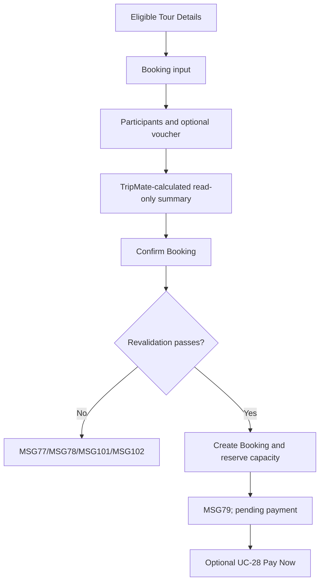

# User Flow Overview

UC-27 creates a Tour Booking independently of payment using TripMate-calculated values.

# Actor

Traveler (authenticated)

# Entry Point

Eligible Tour Details → Book Tour.

# Primary User Goal

Reserve the selected departure/seats with valid participant data and a clear payable total.

# Main Flow

| Step | User Action | System Action | Next State |
|---|---|---|---|
| 1 | Selects Book Tour | Loads selected Tour, departure options, current capacity, and read-only price | Input |
| 2 | Selects departure/quantity and enters participants | Updates read-only calculated summary; validates inputs | Input/Validation |
| 3 | Optionally applies/removes voucher | Validates voucher and recalculates discount/total | Updated Summary |
| 4 | Reviews and confirms Booking | Revalidates Tour/capacity/participants/voucher; disables duplicate submit | Creating |
| 5 | — | Creates Booking, reserves capacity, records statuses/expiry, shows MSG79 | Pending Payment |
| 6 | Selects Pay Now where required | Continues to UC-28 | Electronic Payment |

# Alternative Flows

Voucher apply/remove; booking may exist independently without immediately starting payment.

# Validation Flow

Authenticated; Tour eligible; slots <= remaining; participant data complete/valid; voucher valid/applicable; authoritative amounts calculated by TripMate.

# Error Flow

- Capacity insufficient: MSG77.
- Participant invalid: MSG78/inline.
- Voucher invalid/expired/exhausted: MSG101; minimum spend: MSG102.
- Booking/capacity write failure: no successful Booking/reservation; MSG127.
- Pending payment expires after 15 minutes: MSG80.
- Expired session: MSG125.

# Success State

Booking exists with reserved capacity, initial booking/payment state and expiry; MSG79 is shown.

# Navigation Map

Tour Details → Tour Booking Confirmation → Pending Payment → UC-28 or Booking Details.

# Flow Diagram

# Open Questions

None affecting required screen behavior.

