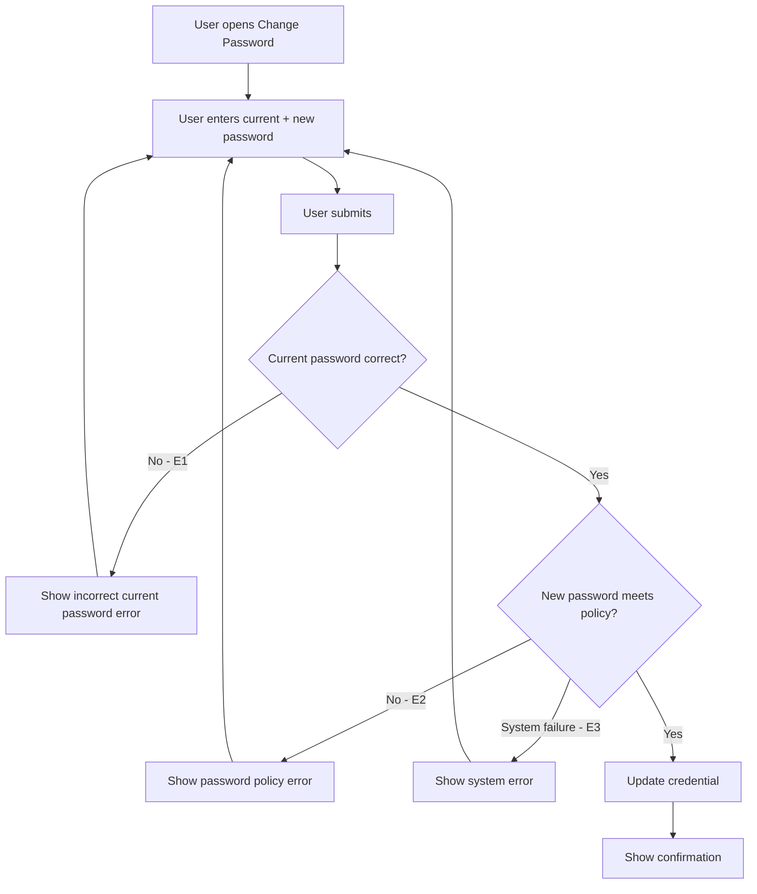

# User Flow Overview

In-app flow for an authenticated user to replace their password using their current password as
verification.

# Actor

Traveler / Tour Operator / Administrator (any authenticated user)

# Entry Point

Account Settings → Change Password.

# Primary User Goal

Replace the current password with a new one that meets the password policy.

# Main Flow

| Step | User Action | System Action | Next State |
|---|---|---|---|
| 1 | User opens Change Password from Account Settings | Displays current/new password fields | Input |
| 2 | User enters current password + new password | — | Input |
| 3 | User submits | Verifies current password; validates new password against policy | Validating |
| 4 | — | On success: updates credential | Success |

# Alternative Flows

None — single linear action, identical for all roles.

# Validation Flow

- Current password must match the stored credential.
- New password must meet the standard password policy.
- (Should Have) New password must differ from the current password.

# Error Flow

- **E1 — Current password incorrect:** inline error; credential unchanged; stays on this screen.
- **E2 — New password fails policy:** inline field-level error; stays on this screen.
- **E3 — System/update failure:** generic error; credential unchanged; user can retry.

# Success State

Credential updated; user sees a confirmation. Whether the current session remains valid or
re-authentication is required is unresolved (see Open Questions).

# Navigation Map

- **Account Settings → Change Password (Input)**
- **Change Password → Success** on valid submission
- **Change Password → Change Password** on any error (E1–E3)
- **Success → Account Settings** (assumption) or **→ Sign In** if re-authentication is required
  (unresolved)

# Flow Diagram

# Open Questions

- Is re-authentication required after a successful change?
- Are other active sessions/devices signed out on change?
- Is a same-as-current-password submission blocked or accepted?
