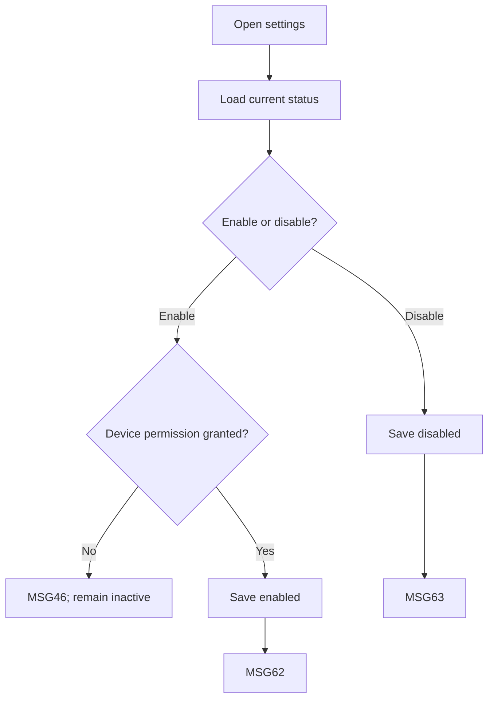

# User Flow Overview

UC-22 saves explicit location-sharing preference and requires device permission before active sharing.

# Actor

Traveler (active group member)

# Entry Point

Travel Group → Group Location Sharing Settings.

# Primary User Goal

Enable or disable group location sharing.

# Main Flow

| Step | User Action | System Action | Next State |
|---|---|---|---|
| 1 | Opens settings | Verifies membership and loads current status | Loaded |
| 2 | Enables or disables | If enabling, checks device location permission | Permission Check or Saving |
| 3 | Grants permission where requested | Saves selected status; disables duplicate action | Saving |
| 4 | — | Shows MSG62 when enabled or MSG63 when disabled | Saved |

# Alternative Flows

Disable sharing without a permission request.

# Validation Flow

Active membership; explicit opt-in; device permission required for enabled state.

# Error Flow

- Permission denied: keep inactive; MSG46.
- No longer active member: no change; MSG126 as applicable.
- Save/network failure: prior value remains; MSG127.
- Expired session: MSG125.

# Success State

Saved status matches selection; location can be shared only when both opt-in and permission are present.

# Navigation Map

Travel Group → Location Sharing Settings → back to group.

# Flow Diagram

# Open Questions

None.

