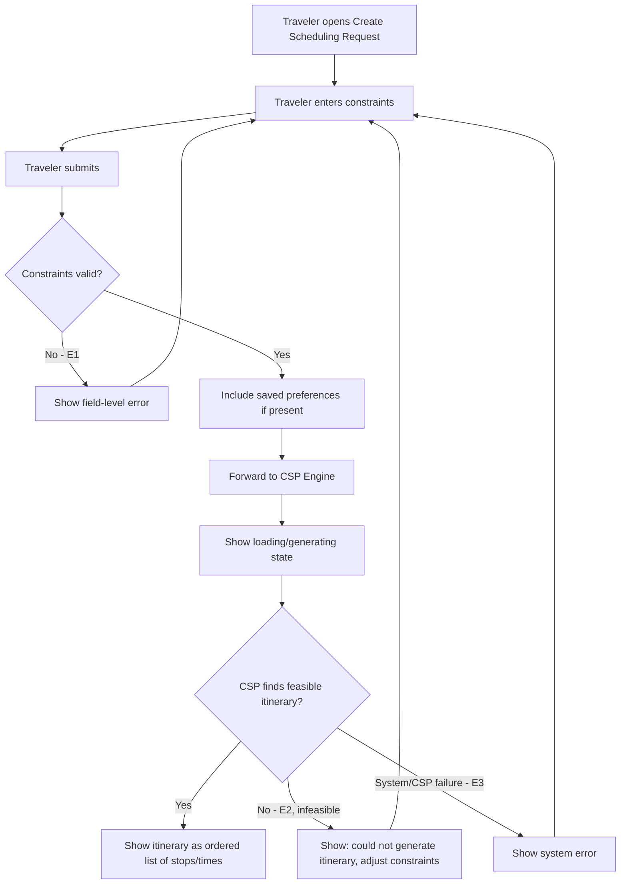

# User Flow Overview

Flow for a Traveler submitting planning constraints and receiving a CSP-generated one-day
itinerary, including the honest "couldn't generate one" outcome for infeasible constraints.

# Actor

Traveler (authenticated)

# Entry Point

Create Scheduling Request.

# Primary User Goal

Get a personalized one-day itinerary that fits the given constraints.

# Main Flow

| Step | User Action | System Action | Next State |
|---|---|---|---|
| 1 | Traveler opens Create Scheduling Request | Displays constraint input form | Input |
| 2 | Traveler enters time, starting point, destination, mandatory locations, budget | — | Input |
| 3 | Traveler submits | Validates request; includes saved preferences (UC-09) if present; forwards to CSP Engine | Validating → Generating |
| 4 | — | CSP Engine attempts to generate a feasible itinerary | Generating |
| 5 | — | On success: presents itinerary as an ordered list of stops with times | Success |

# Alternative Flows

- **AF1 — No saved preferences (UC-09 skipped):** request proceeds using hard constraints only.
- **AF2 — Infeasible constraints:** request passes validation but the CSP Engine cannot produce a
  feasible itinerary — see Error Flow E2, treated as a normal outcome, not a system failure.

# Validation Flow

- Required-field check on hard constraints (exact required/optional split still open — see Open
  Questions).
- Format/range checks (e.g., budget must be a positive number, time range must be internally
  consistent).

# Error Flow

- **E1 — Missing/invalid constraint value:** inline field-level error; stays on Input; nothing
  sent to the CSP Engine.
- **E2 — Infeasible constraints (CSP can't generate a feasible itinerary):** clear message that no
  itinerary could be generated with the given constraints, inviting the Traveler to adjust them.
  This is a **Must Have**, expected outcome — not treated as an error/crash state.
- **E3 — System/CSP service failure:** generic error; Traveler can retry.

# Success State

Itinerary generated and shown as an ordered list of stops with times, satisfying the given hard
constraints and influenced by any saved preferences.

# Navigation Map

- **Entry → Input**
- **Input → Generating (Loading) → Success** on a feasible result
- **Input → Generating (Loading) → Infeasible (E2)** — stays reachable to adjust and resubmit
- **Input → Input** on validation error (E1) or system failure (E3)

# Flow Diagram

# Open Questions

- Exact required vs. optional status of each constraint.
- Confirmed presentation format for the itinerary (list, map, or both) — this flow assumes list
  only for MVP.
- Typical CSP generation time (affects the loading-state design).
- Can the Traveler adjust and resubmit without re-entering everything?
