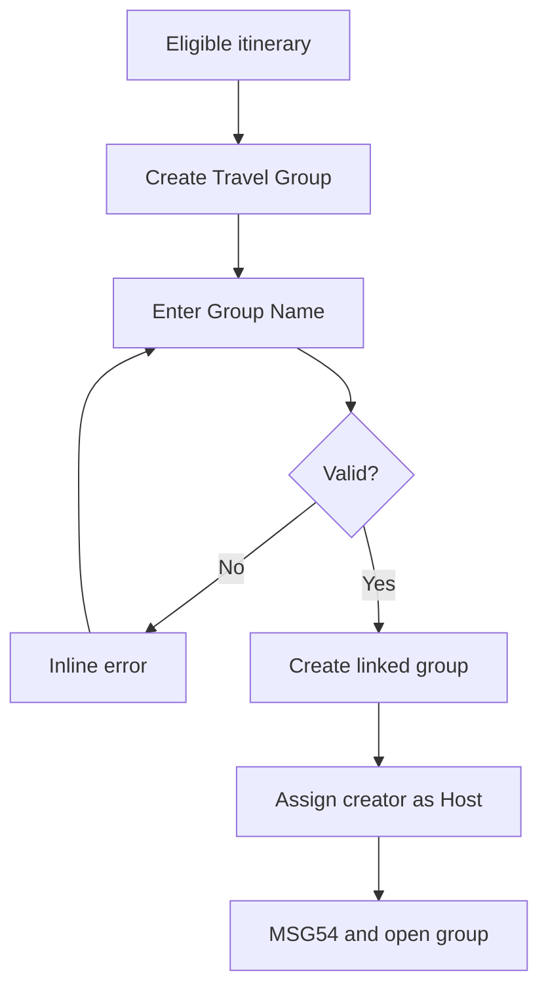

# User Flow Overview

UC-17 creates a Flutter Mobile travel group linked to an existing itinerary.

# Actor

Traveler (authenticated)

# Entry Point

Eligible itinerary → Create Travel Group.

# Primary User Goal

Create a shared travel group and become its Host.

# Main Flow

| Step | User Action | System Action | Next State |
|---|---|---|---|
| 1 | Selects Create Travel Group | Shows selected itinerary and empty Group Name input | Input |
| 2 | Enters Group Name and submits | Validates required input, itinerary, and access; disables repeat submit | Creating |
| 3 | — | Creates group, links itinerary, assigns creator as exclusive Host | Created |
| 4 | — | Shows MSG54 and opens the new group | Travel Group Details |

# Alternative Flows

None defined.

# Validation Flow

Group Name is required and valid; itinerary exists and is accessible.

# Error Flow

- Missing Group Name: inline MSG01.
- Inaccessible/invalid itinerary: no group created.
- Persistence/network failure: no group created; MSG127.
- Expired session or permission failure: MSG125/MSG126.

# Success State

Valid linked group exists, creator is Host, and MSG54 is shown.

# Navigation Map

Eligible Itinerary → Create Travel Group → Travel Group Details & Members.

# Flow Diagram

# Open Questions

None.

