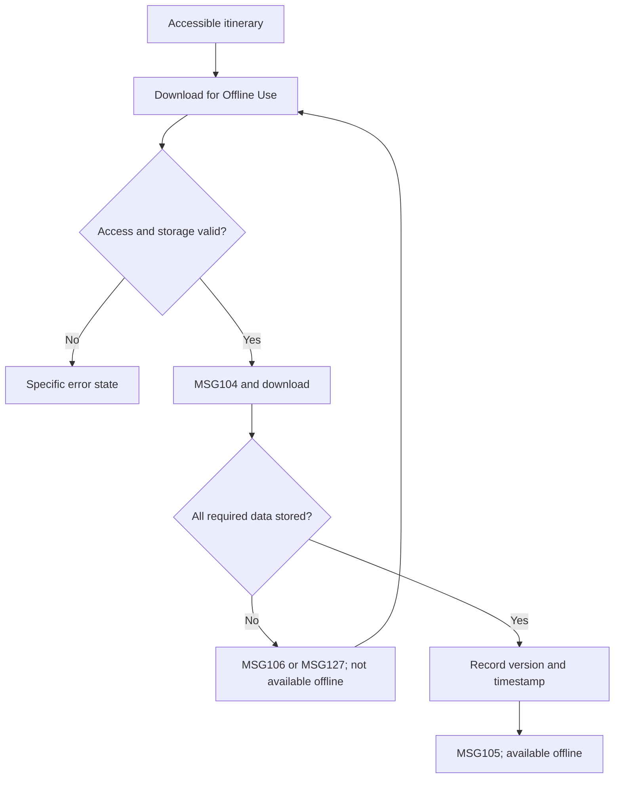

# User Flow Overview

UC-16 downloads the selected accessible itinerary and essential map data for reliable offline access on Flutter Mobile.

# Actor

Traveler (authenticated)

# Entry Point

An accessible itinerary → Download for Offline Use.

# Primary User Goal

Make the selected itinerary available offline.

# Main Flow

| Step | User Action | System Action | Next State |
|---|---|---|---|
| 1 | Opens an accessible itinerary and selects Download for Offline Use | Verifies session, itinerary existence, and access | Checking |
| 2 | — | Identifies current version and required itinerary/POI/route/map data; checks package and free storage | Ready or Error |
| 3 | Confirms/starts download where required | Displays MSG104; disables duplicate submission; downloads data | Downloading |
| 4 | — | Stores data locally and verifies every required component | Verifying |
| 5 | — | Records local version/timestamp, marks available offline, displays MSG105 | Available Offline |

# Alternative Flows

- Retry after an interrupted or failed download.
- Open the already downloaded itinerary in its offline-available state.

# Validation Flow

- Authenticated Traveler; accessible existing itinerary.
- Sufficient storage for the configured 150 MB limit.
- All required components stored before availability is granted.

# Error Flow

- Connectivity interruption: discard/withhold partial availability and show MSG106.
- Insufficient storage: stop and show MSG107.
- Other network/server failure: show MSG127; retain the prior state.
- Expired session: MSG125 and sign-in handoff preserving destination.

# Success State

Current itinerary version is marked available offline with its download timestamp; MSG105 is shown.

# Navigation Map

- Itinerary Details → Offline Map & Itinerary.
- Offline Map & Itinerary → Available Offline state.
- Error → same screen with Retry.
- Session expiry → Sign In → intended destination.

# Flow Diagram

# Open Questions

None that change the finalized flow.

