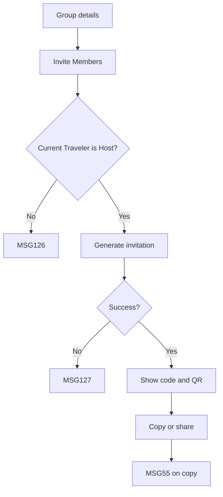

# User Flow Overview

UC-18 generates a code and QR invitation for the selected travel group without creating membership.

# Actor

Traveler acting as Group Host

# Entry Point

Travel Group Details & Members → Invite Members.

# Primary User Goal

Generate and share a usable group invitation.

# Main Flow

| Step | User Action | System Action | Next State |
|---|---|---|---|
| 1 | Selects Invite Members | Verifies group and Host permission | Checking |
| 2 | — | Generates a unique invitation linked to the group and its QR representation | Invitation Ready |
| 3 | Copies code or shares invitation | Copies/shares the selected artifact; shows MSG55 on copy | Invitation Ready |

# Alternative Flows

- Reopen an existing currently usable invitation if the system supplies it; no quota behavior is inferred.

# Validation Flow

Group exists; current Traveler is Host; invitation references the correct group and is usable.

# Error Flow

- Not Host: MSG126.
- Generation/network failure: MSG127.
- Expired session: MSG125.

# Success State

Invitation code and QR invitation are visible; group membership is unchanged.

# Navigation Map

Travel Group Details & Members → Invite Group Members → back to group details.

# Flow Diagram

# Open Questions

Invitation expiration is displayed only when supplied by the finalized data.

