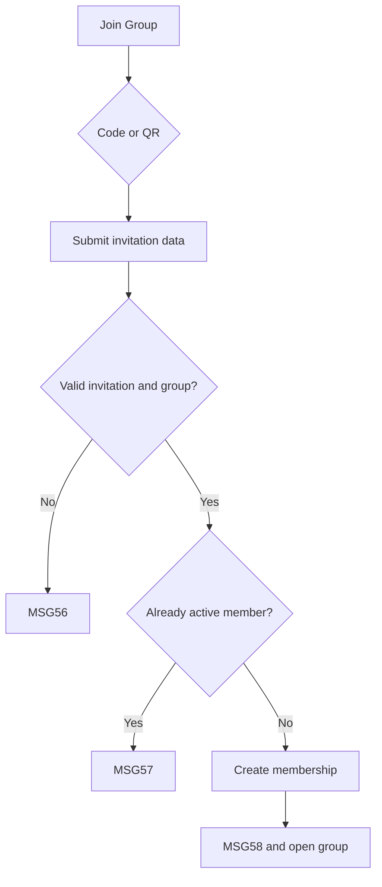

# User Flow Overview

UC-23 joins a shared group through code or QR and creates membership only after validation.

# Actor

Traveler (authenticated)

# Entry Point

Travel Groups → Join Group, or supported QR invitation entry.

# Primary User Goal

Join the invited group and access its permitted shared trip.

# Main Flow

| Step | User Action | System Action | Next State |
|---|---|---|---|
| 1 | Opens Join Shared Group Trip | Shows invitation-code input and Scan QR action | Input |
| 2 | Enters code or scans QR and submits | Retrieves and validates invitation, group, and membership | Validating |
| 3 | — | Creates active membership and records Joined Timestamp | Joining |
| 4 | — | Makes permitted shared data accessible, shows MSG58, and opens group | Joined Group |

# Alternative Flows

Code input and QR invitation are equivalent supported entry methods.

# Validation Flow

Invitation exists, usable and unexpired where applicable; group exists/available; Traveler not already active.

# Error Flow

- Missing code where code path used: inline MSG01.
- Invalid/expired/unavailable invitation or group: MSG56.
- Already active member: MSG57.
- Creation/network failure: no membership; MSG127.
- Expired session: MSG125.

# Success State

Exactly one active membership exists and the group is displayed with MSG58.

# Navigation Map

Travel Groups → Join Shared Group Trip → Travel Group Details & Members.

# Flow Diagram

# Open Questions

None.

