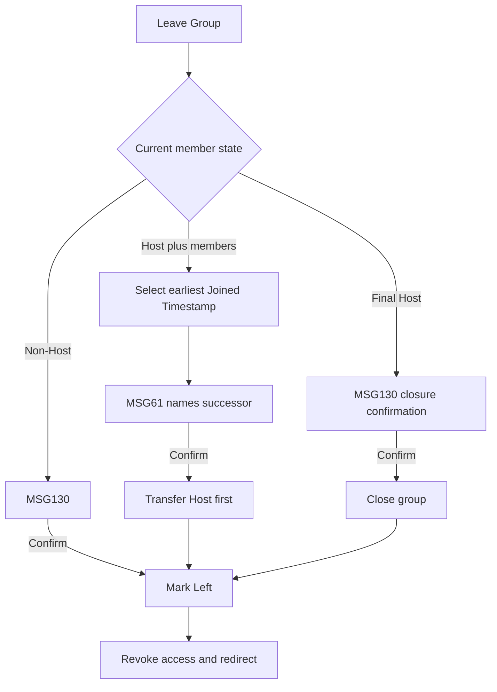

# User Flow Overview

UC-21 lets an active member leave while enforcing BR-49 Host succession/closure.

# Actor

Traveler (active group member)

# Entry Point

Travel Group Details & Members → Leave Group.

# Primary User Goal

Leave the group safely.

# Main Flow

| Step | User Action | System Action | Next State |
|---|---|---|---|
| 1 | Selects Leave Group | Verifies active membership and determines Host state | Decision |
| 2 | Reviews confirmation | Non-Host/final Host receives MSG130; Host with remaining members receives MSG61 naming the deterministic successor | Confirmation |
| 3 | Confirms | Disables action and revalidates current membership/Host state | Leaving |
| 4 | — | Transfers Host first if required, or closes group if final member; marks membership Left and records timestamp | Left |
| 5 | — | Revokes access, redirects away, and shows MSG129 where applicable | Outside Group |

# Alternative Flows

- Host with remaining members: successor is the active remaining member with earliest Joined Timestamp.
- Host final member: close group.
- Cancel: no change.

# Validation Flow

Active membership; exactly one Host while active members remain; successor transfer completes before current Host leaves.

# Error Flow

- Membership/Host state invalid or changed: stop with no update.
- Successor transfer fails: current Host remains.
- Write/network failure: prior membership remains; MSG127.
- Expired session: MSG125.

# Success State

Traveler is Left, access revoked; group has one valid Host or is Closed.

# Navigation Map

Group Details → Leave confirmation → Travel Groups/previous safe destination.

# Flow Diagram

# Open Questions

None.

