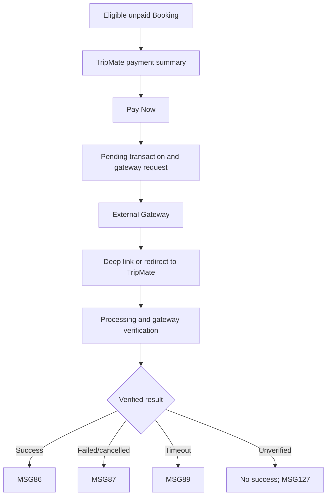

# User Flow Overview

UC-28 hands an eligible Booking to an external gateway and shows only TripMate-verified result states.

# Actor

Traveler / External Payment Gateway

# Entry Point

Eligible unpaid Booking → Pay Now.

# Primary User Goal

Complete payment and receive a verified TripMate result.

# Main Flow

| Step | User Action | System Action | Next State |
|---|---|---|---|
| 1 | Opens Electronic Payment | Verifies ownership/eligibility and loads authoritative amount/gateway | Payment Ready |
| 2 | Selects Pay Now | Disables action, creates Pending Transaction, generates request; MSG85 for VNPay | Redirecting |
| 3 | Completes payment externally | External gateway handles payment UI | External Gateway |
| 4 | Returns via mobile deep link/web redirect | Shows Processing; does not trust return as success | Verifying |
| 5 | — | Verifies authoritative gateway result/IPN and persists transaction/booking state | Verified Result |
| 6 | Reviews result | Shows exact success/failure/timeout/duplicate/error state | Result |

# Alternative Flows

Gateway cancellation/failure, timeout, duplicate payment block, or unverified/mismatched result.

# Validation Flow

Owned eligible Booking; not already paid; authoritative amount; verified gateway confirmation.

# Error Flow

- Already paid: MSG88.
- Amount mismatch: MSG92.
- Gateway timeout: MSG89.
- Cancelled/failed: MSG87.
- Unverified result: never show success; MSG127 where no specific message.
- Expired session: MSG125.

# Success State

Only verified success shows MSG86 and paid/confirmed Booking state.

# Navigation Map

Booking → Electronic Payment → External Gateway → deep link/redirect → Electronic Payment Processing → Payment Result/Booking Details.

# Flow Diagram

# Open Questions

None affecting the authoritative verification rule.

