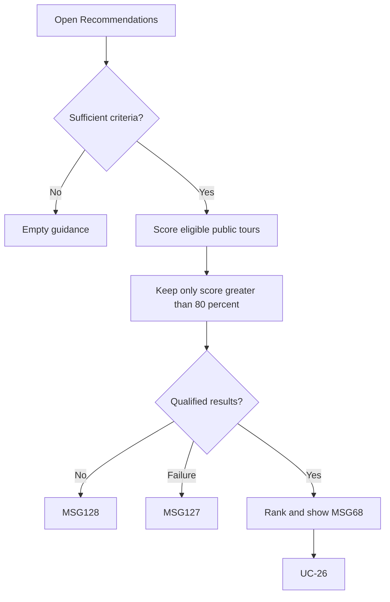

# User Flow Overview

UC-25 displays ranked Tour recommendations with scores strictly greater than 80%.

# Actor

Traveler (authenticated)

# Entry Point

Traveler Home/Tours → Tour Recommendations.

# Primary User Goal

Find an eligible Tour closely matched to current criteria/preferences.

# Main Flow

| Step | User Action | System Action | Next State |
|---|---|---|---|
| 1 | Opens Recommendations | Verifies session and obtains available criteria/preferences | Loading |
| 2 | — | Retrieves eligible public tours and calculates similarity | Matching |
| 3 | — | Keeps only scores >80%, excludes unavailable tours, ranks results | Results |
| 4 | Changes page or selects recommendation | Preserves list state; opens UC-26 | Results or Tour Details |

# Alternative Flows

Request personalized recommendations again when sufficient criteria become available.

# Validation Flow

Authenticated Traveler; sufficient criteria; eligible public tours; strict >80% qualification.

# Error Flow

- Insufficient criteria: no personalized results; generic empty state where applicable.
- No eligible tours or no score >80%: MSG128.
- Processing/network failure: MSG127.
- Expired session: MSG125.

# Success State

Ranked recommendations with MSG68 score content are displayed; no Booking changed.

# Navigation Map

Traveler Home → Tour Recommendations → Tour Details → preserved Recommendations.

# Flow Diagram

# Open Questions

Exact criteria-sufficiency rules are not defined in the source.

