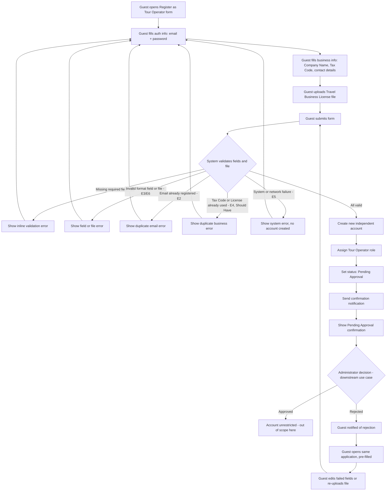

# User Flow Overview

End-to-end flow for a Guest submitting a Tour Operator business registration: fill the form,
upload the Travel Business License, submit, and reach Pending Approval. Includes the
edit-and-resubmit loop when an Administrator later rejects the application (decision made
downstream, outside this flow).

# Actor

Guest (unauthenticated visitor)

# Entry Point

The "Register as Tour Operator" registration form.

# Primary User Goal

Submit a complete registration (auth info + business/legal info + license file) and reach
Pending Approval status.

# Main Flow

| Step | User Action | System Action | Next State |
|---|---|---|---|
| 1 | Guest opens the "Register as Tour Operator" form | Displays an empty registration form | Registration Form — Input |
| 2 | Guest enters email + password | — | Registration Form — Input |
| 3 | Guest enters Company Name, Tax Code, business contact details | — | Registration Form — Input |
| 4 | Guest uploads the Travel Business License file (PDF or image) | Accepts and attaches the file | Registration Form — Input |
| 5 | Guest submits the form | Validates all required fields, formats, and the uploaded file; checks email uniqueness | Validating |
| 6 | — | On success: creates a new, independent account; assigns Tour Operator role; sets status Pending Approval; sends confirmation notification | Success — Pending Approval |

# Alternative Flows

- **AF1 — Guest is already logged in as another role (e.g., Traveler):** No special branch. Per
  BR6 (registration always creates a brand-new, independent account), the flow is identical to an
  unauthenticated Guest — the existing session/account is not linked or upgraded.
- **AF2 — Resubmission after rejection:** Triggered outside this flow, by the downstream
  Administrator Approval use case rejecting the application.
  1. Guest is notified of the rejection (channel not yet defined — see Open Questions).
  2. Guest opens the same existing application, pre-filled with previously submitted values.
  3. Guest edits the failed field(s) and/or re-uploads the license file.
  4. Guest resubmits — re-enters Main Flow at **Step 5 (Validating)** on the same application
     record, not a new one. *(BR8)*
- **Save-and-resume for a partially filled form** is a Could Have in the MVP scope, not part of
  this MVP flow.

# Validation Flow

- Required-field check: email, password, Company Name, Tax Code, business contact details,
  license file.
- Format check: email format, Tax Code / License format (placeholder rules — jurisdiction-specific
  rules still open), license file type and size.
- Duplicate authentication identifier (email) check — Must Have.
- Duplicate business identity (Tax Code / License) check — **Should Have**, since BR5 is still an
  unconfirmed assumption; if not implemented at launch, this validation step does not run.
- On resubmission, all duplicate checks must exclude the Guest's own existing application record.

# Error Flow

- **E1 — Missing required field(s):** Inline validation error per field; stays on Registration
  Form; no account created.
- **E2 — Duplicate email:** "Email already registered" error; stays on Registration Form.
- **E3 — Invalid format:** Field-level error for Tax Code, License, or contact details; stays on
  Registration Form.
- **E4 — Duplicate business identity:** Error indicating the Tax Code/License is already
  registered; stays on Registration Form. *(Should Have — depends on BR5 being confirmed/built)*
- **E5 — System/submission failure:** Generic error; no partial or corrupt account is created;
  Guest can retry.
- **E6 — Invalid license file:** File-specific error (missing, unsupported format, or too large);
  stays on Registration Form.

# Success State

A new, independent account exists with the Tour Operator role, status = Pending Approval,
restricted from publishing tours or receiving bookings. The Guest sees an on-screen confirmation
and receives a notification that the application is under review.

**Assumption:** where the Guest lands right after this confirmation (e.g., redirected to Login,
same as the Traveler registration flow, vs. staying on a dedicated "Application Submitted"
screen) is not decided for this feature — flagged in Open Questions rather than invented here.

# Navigation Map

- **Entry →** Registration Form (Input)
- **Registration Form → Success** on valid submission → Pending Approval confirmation
- **Registration Form → Registration Form** on any validation/error (E1–E6), same screen with
  error state
- **(External) Rejection notification → Registration Form (pre-filled, Edit/Resubmission state)**
  → back into Validating on resubmit

# Flow Diagram

# Open Questions

- Where does the Guest land immediately after successful submission (dedicated confirmation
  screen vs. redirect to Login, etc.)?
- What is the notification channel for the rejection that triggers AF2 (email, in-app, both)?
- Is the duplicate business identity check (E4) actually built for MVP, given BR5 is still an
  assumption — or does the flow ship without it initially?
- What are the accepted file formats/max size for the license upload (affects the exact wording
  of E6)?
- Is there a cap on resubmission attempts (AF2), or can a Guest loop through Step 5 indefinitely?
