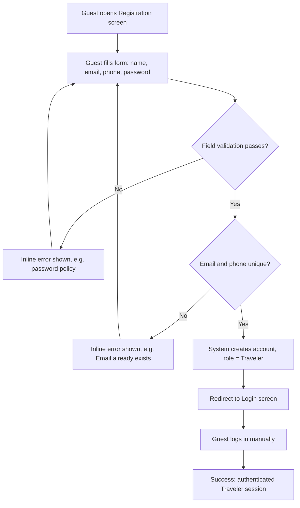

# User Flow Overview

This flow covers the smallest complete journey for a Guest to self-register a TripMate account and reach an authenticated Traveler state via manual login. It is derived from the approved MVP scope in `requirements/mvp/register-traveler-account.md`. Google Social Login is Could Have / deferred and is not included in the Main Flow.

# Actor

- **Guest** — unauthenticated visitor performing registration.
- **TripMate System** — validates input, enforces uniqueness, creates the account, issues the redirect.

# Entry Point

Guest lands on the **Registration screen**. *(Assumption — the entry mechanism itself is not described in source)*

Example entry path: a "Sign Up" link/button from the Login screen or landing page. *(UX Suggestion — not specified in source)*

# Primary User Goal

Create a TripMate account and reach the Login screen ready to sign in as a Traveler.

# Main Flow

**Step 1**
- User Action: Guest opens the Registration screen.
- System Action: System renders the registration form (fields: full name, email, phone number, password) and the ToS/Privacy text annotation with link below the Register button.
- Next State: Registration form (empty), awaiting input.

**Step 2**
- User Action: Guest fills in full name, email, phone number, and password, then submits (taps "Register").
- System Action: System validates the submission — required fields present, email format, and password policy (min 8 characters, 1 uppercase, 1 lowercase, 1 number, 1 special character).
- Next State: If validation fails → Validation Flow. If validation passes → proceed to Step 3.

**Step 3**
- User Action: (none — system-driven)
- System Action: System checks uniqueness of email and phone number against existing accounts.
- Next State: If either is a duplicate → Error Flow. If both unique → proceed to Step 4.

**Step 4**
- User Action: (none — system-driven)
- System Action: System creates the account, assigns role = Traveler.
- Next State: Account created → proceed to Step 5.

**Step 5**
- User Action: (none — automatic)
- System Action: System redirects Guest to the Login screen (no auto-login).
- Next State: Login screen, awaiting credentials.

**Step 6**
- User Action: Guest enters email + password and logs in manually.
- System Action: System authenticates and grants Traveler session.
- Next State: Success State reached.

# Alternative Flows

- **Google Social Login** — Out of Main Flow for MVP (Could Have, source Alternative Flow A1). Not included until explicitly scoped in.

# Validation Flow

Triggered when submitted data fails field-level validation (missing required field, malformed email, password not meeting policy):
1. System rejects the submission without creating an account.
2. System displays an inline error message (e.g., "Password is not 8 characters long"). *(Placement of the message relative to the field is a UX Suggestion — not specified in source)*
3. Guest remains on the Registration form to correct input. *(Whether previously entered field values are retained is unresolved — see Open Questions)*
4. Guest corrects input and resubmits → returns to Step 2.

# Error Flow

Triggered when the uniqueness check fails (email or phone already registered):
1. System rejects the submission without creating an account.
2. System displays an inline error message (e.g., "Email already exists").
3. Guest remains on the Registration form to correct input. *(Whether previously entered field values are retained is unresolved — see Open Questions)*
4. Guest corrects the conflicting field and resubmits → returns to Step 2 (which re-runs validation, then Step 3 uniqueness check).

# Success State

Guest has an account with role = Traveler and is authenticated via manual login on the Login screen, ready to access Traveler features.

# Navigation Map

- Registration screen → (submit success) → Login screen → (login success) → Traveler home/landing screen *(destination screen not yet specified — see Open Questions)*
- Registration screen → (validation/duplicate error) → Registration screen (same screen, inline errors)

# Flow Diagram

# Open Questions

- What screen does the Guest land on immediately after a successful manual login (Traveler home/dashboard)? Not specified in source use case or MVP plan.
- Does the Registration screen retain non-sensitive field values (name, email, phone) after a validation/duplicate error, or does the Guest re-enter everything? Not specified in source; a common UX pattern is to retain non-sensitive values, but this is not confirmed by stakeholder.
- Is there a visible link from Login screen back to Registration for Guests who don't yet have an account? Not specified in source. *(UX Suggestion — commonly paired, but not confirmed)*

