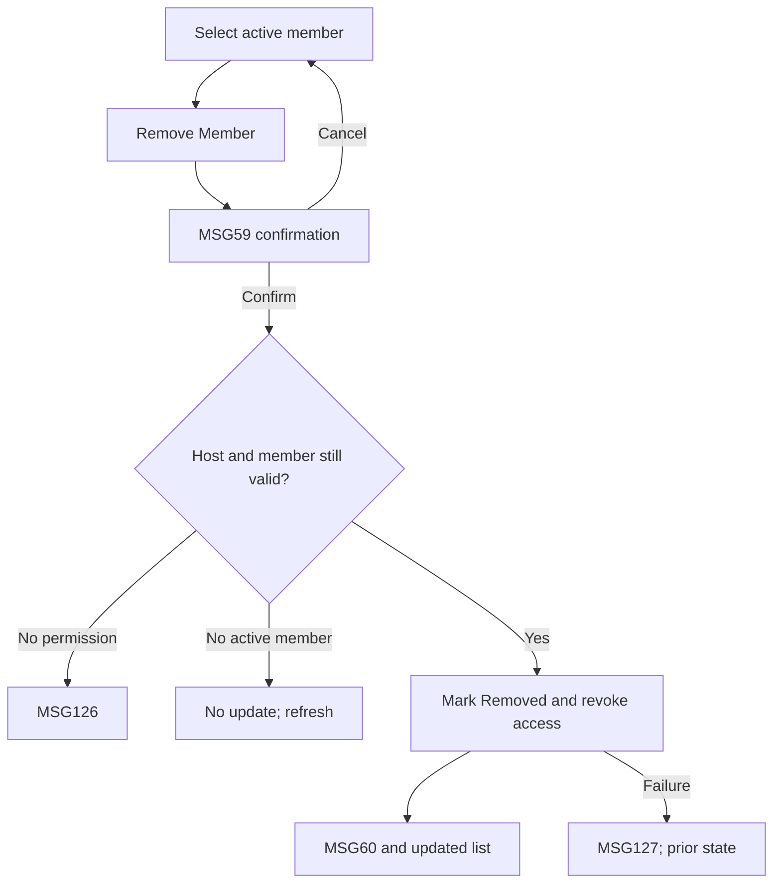

# User Flow Overview

UC-20 removes an eligible active group member only after Host confirmation.

# Actor

Traveler acting as Group Host

# Entry Point

Travel Group Details & Members → active member action → Remove Member.

# Primary User Goal

Remove an active member and revoke group-only access.

# Main Flow

| Step | User Action | System Action | Next State |
|---|---|---|---|
| 1 | Selects active member and Remove Member | Displays MSG59 confirmation | Confirmation |
| 2 | Confirms | Disables action; verifies Host permission and active membership | Removing |
| 3 | — | Marks membership Removed, records end timestamp, revokes access | Removed |
| 4 | — | Shows MSG60 and refreshes member list | Updated Members |

# Alternative Flows

Cancel confirmation → close modal with no change.

# Validation Flow

Group exists; current Traveler is Host; target membership is active.

# Error Flow

- Not Host: MSG126.
- Target no longer active: no update; refresh current data.
- Write/network failure: previous membership remains; MSG127.
- Expired session: MSG125.

# Success State

Member is inactive, access is revoked, list reflects the new state, and MSG60 is shown.

# Navigation Map

Members list → Remove confirmation → updated Members list.

# Flow Diagram

# Open Questions

None.

