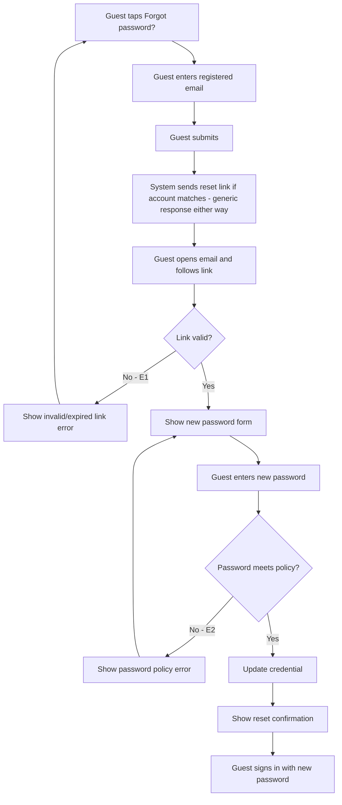

# User Flow Overview

Self-service email-based password reset: request → email link → set new password → sign in.

# Actor

Guest holding a registered account, unable to sign in.

# Entry Point

"Forgot password?" link (e.g., from the Sign In screen).

# Primary User Goal

Regain access by setting a new password.

# Main Flow

| Step | User Action | System Action | Next State |
|---|---|---|---|
| 1 | Guest taps "Forgot password?" | Displays email input | Request — Input |
| 2 | Guest enters registered email | — | Request — Input |
| 3 | Guest submits | Validates format; sends reset link if a matching account exists; responds generically either way | Request Sent |
| 4 | Guest opens email, follows reset link | Verifies the link | Verifying |
| 5 | — (link valid) | Displays new-password form | Set New Password |
| 6 | Guest enters new password | Validates against password policy | Validating |
| 7 | — | Updates credential, confirms success | Success |

# Alternative Flows

- **AF1 — Phone/OTP reset:** Could Have, not in this MVP flow diagram.

# Validation Flow

- Email format check at request step.
- Reset link validity check (not expired, not already used).
- New password validated against the standard password policy (same as registration).

# Error Flow

- **E1 — Invalid/expired reset link:** error shown, Guest can request a new one; no password
  change occurs.
- **E2 — New password fails policy:** field-level error; stays on Set New Password state.
- **E3 — System/delivery failure:** generic error; Guest can retry the request.

# Success State

Account credential updated; Guest sees a confirmation and can proceed to Sign In (UC-04) with the
new password.

# Navigation Map

- **Sign In → (Forgot password?) → Request (Input)**
- **Request → Request Sent** (generic confirmation, regardless of whether the email matched an
  account)
- **Email link → Verifying → Set New Password** (only if link is valid)
- **Set New Password → Success → Sign In**
- **Any error → stays on the relevant step**

# Flow Diagram

# Open Questions

- Exact reset link expiry time.
- Is the Guest auto-signed-in after reset, or redirected to Sign In (per the "generic response"
  choice, and consistent with the register-traveler-account no-auto-login decision)?
- Resend behavior if the email doesn't arrive.
