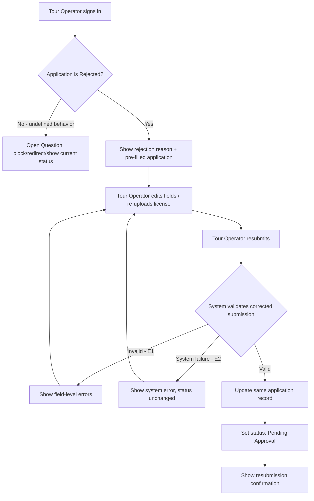

# User Flow Overview

Flow for a signed-in Tour Operator whose application was rejected: see the rejection reason, fix
the flagged information/documents, and resubmit on the same application record.

# Actor

Tour Operator (authenticated, existing account with a Rejected application)

# Entry Point

Sign In (depends on UC-04), landing on an account/application status area after authentication.

# Primary User Goal

Correct the rejected application and get it back into Pending Approval.

# Main Flow

| Step | User Action | System Action | Next State |
|---|---|---|---|
| 1 | Tour Operator signs in | Authenticates and detects a Rejected application | Rejection Review |
| 2 | — | Displays the Administrator's rejection reason and the previously submitted application, pre-filled | Rejection Review |
| 3 | Tour Operator edits flagged fields and/or re-uploads the license file | — | Editing |
| 4 | Tour Operator resubmits | Validates the corrected submission | Validating |
| 5 | — | On success: updates the same application record, sets status to Pending Approval, confirms | Success — Pending Approval |

# Alternative Flows

- **AF1 — No Rejected application found:** Tour Operator signs in but their application is not in
  Rejected status. Behavior undefined in source (block, redirect, or show current status instead)
  — see Open Questions.

# Validation Flow

- Same field/format/file validation as initial registration (reused, not redefined).
- Enforcement that this flow is only reachable for a Rejected application — Should Have, not
  guaranteed at MVP (see MVP Scope).

# Error Flow

- **E1 — Corrected submission still fails validation:** field-level errors shown; stays on
  Editing state; application remains Rejected.
- **E2 — System/submission failure:** generic error; application status unchanged (stays
  Rejected); Tour Operator can retry.

# Success State

Application record updated with corrected info, status = Pending Approval, account still
restricted from publishing/receiving bookings until Administrator approval. Tour Operator sees a
confirmation.

# Navigation Map

- **Entry (Sign In) → Rejection Review** (only if application is Rejected)
- **Rejection Review → Editing** (implicit, same screen — user starts typing)
- **Editing → Success** on valid resubmission
- **Editing → Editing** on any validation/system error
- **No Rejected application → undefined destination** (see Open Questions)

# Flow Diagram

# Open Questions

- What happens when a signed-in Tour Operator has no Rejected application (block, redirect,
  show current status)?
- Must all flagged issues be corrected before resubmission is allowed?
- Is there a cap on resubmission attempts?
- Is prior rejection history visible, or only the latest reason?
