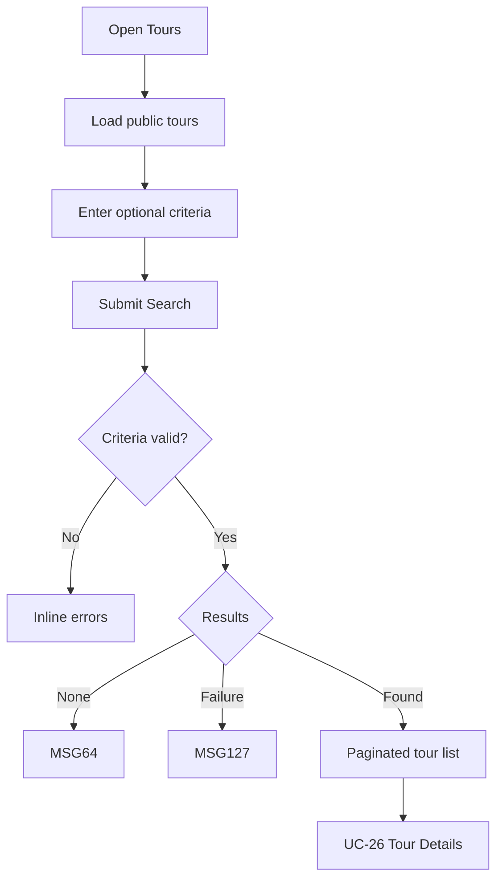

# User Flow Overview

UC-24 browses and searches public tours on Mobile and responsive Web; the current UI generation is mobile-first.

# Actor

Guest / Traveler

# Entry Point

Public Home or Traveler navigation → Tours.

# Primary User Goal

Find a suitable public Tour and open its details.

# Main Flow

| Step | User Action | System Action | Next State |
|---|---|---|---|
| 1 | Opens Tours | Loads first 20 approved/public tours and total count | Loaded List |
| 2 | Enters optional filters/sort | Does not search yet | Criteria Ready |
| 3 | Submits Search | Validates criteria and retrieves matching eligible tours | Loading |
| 4 | Changes page or selects a result | Preserves page/filter/sort; opens selected Tour Details | Results or UC-26 |

# Alternative Flows

Browse without criteria; return from UC-26 to preserved results.

# Validation Flow

Valid formats; end date not before start; minimum price not above maximum.

# Error Flow

- Invalid criteria: inline field errors.
- No matches: MSG64.
- Selected tour becomes unavailable: MSG65.
- Search/network failure: MSG127.
- Traveler session expiry does not prevent public browsing; protected actions follow MSG125.

# Success State

Matching public tours and total count are displayed; no Booking changed.

# Navigation Map

Home/Tours → Search Tours → Tour Details → preserved Search Tours.

# Flow Diagram

# Open Questions

No additional filters beyond those supported by Report 3 are assumed.

