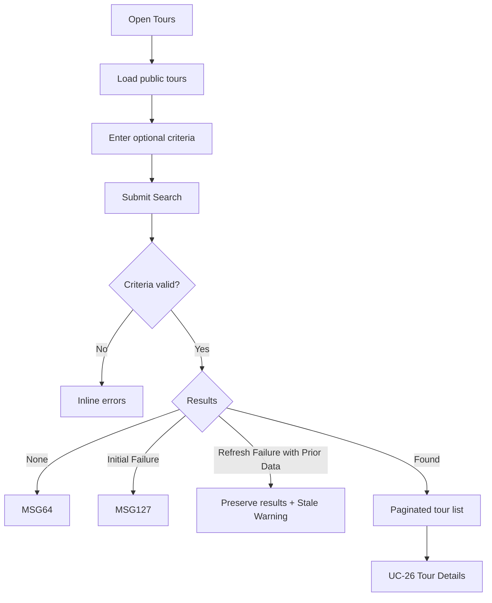

# User Flow Overview

UC-24 (`TM-70`) browses and searches public tours on Flutter Mobile and responsive Next.js Web.

# Actor

Guest / Traveler

# Entry Point

Public Home or Traveler navigation → Tours.

# Primary User Goal

Find a suitable public Tour by destination, single departure date, and whole-VND price range, inspect real-time schedule availability, and open its details.

# Owned TM-70 Search Scope vs Out-of-Scope SRS Filters

- **Owned Scope**:
  - `destination`: optional string, trimmed and normalized to Unicode NFC before validation/request, max 300 characters.
  - `departureDate`: optional single departure date (`YYYY-MM-DD`, evaluated in `Asia/Ho_Chi_Minh`).
  - `minPrice` / `maxPrice`: optional whole-VND integers (`0..9,999,999,999`, `minPrice <= maxPrice`).
  - `page` / `pageSize`: `page >= 1`, default `pageSize = 20` (`1..100`), deterministic order `title ASC, tourId ASC`.
  - Real-time availability summary (`available`, `soldOut`, `noUpcomingSchedule`, `unknown`, `remainingSlots`, `departureAtUtc`).
- **Out-of-Scope SRS Filters (Deferred)**:
  - `keyword`, `date range`, `duration`, `category`, `rating`, `sort`, and `interest tags`.
- **Platform Pagination Pattern**:
  - **Web**: Numbered pagination (`TourPagination`, 20 items per page, URL search-param synced).
  - **Mobile**: Infinite scroll (85% scroll threshold `loadNextPage` with `tourId` deduplication) + pull-to-refresh (`RefreshIndicator`).

# Main Flow

| Step | User Action | System Action | Next State |
|---|---|---|---|
| 1 | Opens Tours | Loads first 20 approved/public tours and total count | Loaded List |
| 2 | Enters optional filters (`destination`, single `departureDate`, `minPrice`, `maxPrice`) | Does not search on keystroke (CR-02) | Criteria Ready |
| 3 | Submits Search / Apply filters | Normalizes `destination` to Unicode NFC, validates criteria, and retrieves matching eligible tours | Loading |
| 4 | Navigates pages (Web numbered pagination; Mobile infinite scroll / pull-to-refresh) or selects a result | Preserves page and active filters; opens selected Tour Details | Results or UC-26 |

# Alternative Flows

Browse without criteria; return from UC-26 to preserved results.

# Validation Flow

- `destination` normalized to Unicode NFC + trimmed, length $\le 300$.
- `departureDate` valid calendar date (`YYYY-MM-DD`) and not in the past.
- `minPrice` and `maxPrice` whole-VND integers in `0..9,999,999,999` with `minPrice <= maxPrice`.
- Web BFF proxy rejects duplicate or unknown query keys with HTTP 400 ProblemDetails.

# Error Flow

- Invalid criteria: inline field errors; no search request dispatched.
- No matches: MSG64.
- Selected tour becomes unavailable: MSG65.
- Initial search/network failure: MSG127 full error state with retry.
- Subsequent refresh/search failure with loaded results: preserve existing results and pagination, display non-destructive warning banner with retry.
- Traveler session expiry does not prevent public browsing; protected actions follow MSG125.

# Success State

Matching public tours and total count are displayed; no Booking changed.

# Navigation Map

Home/Tours → Search Tours → Tour Details → preserved Search Tours.

# Flow Diagram

```mermaid
flowchart TD
    A[Open Tours] --> B[Load public tours]
    B --> C[Enter optional criteria]
    C --> D[Submit Search]
    D --> E{Criteria valid?}
    E -->|No| F[Inline errors]
    E -->|Yes| G{Results}
    G -->|None| H[MSG64]
    G -->|Initial Failure| I[MSG127]
    G -->|Refresh Failure with Prior Data| L[Preserve results + Stale Warning]
    G -->|Found| J[Paginated tour list]
    J --> K[UC-26 Tour Details]
```

# Open Questions

Future SRS filters (`keyword`, `date range`, `duration`, `category`, `rating`, `sort`, `interest tags`) are deferred; only the owned TM-70 parameters are exposed.
