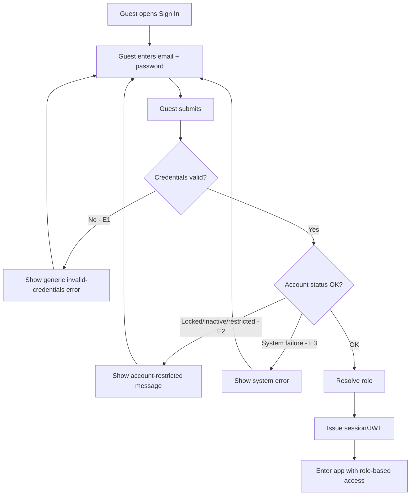

# User Flow Overview

Flow for an existing account holder authenticating into TripMate via email/password (MVP scope),
landing in the app under their assigned role.

# Actor

Guest holding a registered account (any role)

# Entry Point

Sign In screen, reachable from anywhere an unauthenticated Guest needs to authenticate (e.g., a
"Sign In" link/button; exact entry points not enumerated in source).

# Primary User Goal

Authenticate and enter the app with role-appropriate access.

# Main Flow

| Step | User Action | System Action | Next State |
|---|---|---|---|
| 1 | Guest opens Sign In | Displays email + password fields | Input |
| 2 | Guest enters email + password | — | Input |
| 3 | Guest submits | Validates credentials | Validating |
| 4 | — | Checks account status (locked/inactive/restricted) | Validating |
| 5 | — | On success: resolves role, issues session/JWT | Success |

# Alternative Flows

- **AF1 — Phone/OTP sign-in:** Should Have, not in this MVP flow diagram.
- **AF2 — Google Social Login:** Could Have, not in this MVP flow diagram.

# Validation Flow

- Required-field check (email, password).
- Credential match check against stored account.
- Account status check (locked/inactive/restricted), independent of credential correctness.

# Error Flow

- **E1 — Invalid credentials:** generic error (does not reveal whether email or password was
  wrong); stays on Sign In screen.
- **E2 — Locked/inactive/restricted account:** blocked with a status-specific message (exact
  wording depends on undefined account access rules — see Open Questions); stays on Sign In
  screen.
- **E3 — System/authentication service failure:** generic error; no session issued; Guest can
  retry.

# Success State

Session/JWT issued; Guest is now authenticated and enters the app under their resolved role
(Traveler, Tour Operator, or Administrator), with access per that role and current account
status.

# Navigation Map

- **Entry → Sign In (Input)**
- **Sign In → Success** on valid credentials + acceptable account status
- **Sign In → Sign In** on any error (E1–E3)
- **Success → role-appropriate landing area** (not defined in source — each role's landing
  destination is out of scope for this flow)

# Flow Diagram

# Open Questions

- Where does each role land after successful sign-in (Traveler home, Tour Operator dashboard,
  Admin panel)?
- What exact message is shown for a locked/inactive/restricted account (E2)?
- Are phone/OTP and Google Social Login part of the same Sign In screen (as tabs/options) or
  separate entry points, once built?
