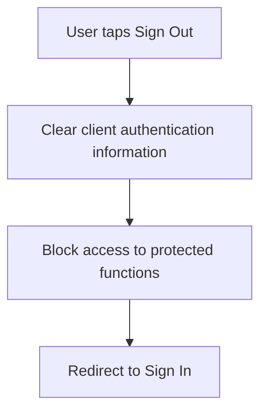

# User Flow Overview

Single-action flow for an authenticated user ending their session and returning to an
unauthenticated state.

# Actor

Traveler / Tour Operator / Administrator (any authenticated user)

# Entry Point

A "Sign Out" action available somewhere in the authenticated app shell (e.g., a menu item) —
exact placement not defined in source.

# Primary User Goal

End the current session so protected functions require signing in again.

# Main Flow

| Step | User Action | System Action | Next State |
|---|---|---|---|
| 1 | User taps Sign Out | Clears/invalidates client-held authentication information | Signing Out |
| 2 | — | Blocks further access to protected functions on this session | Signed Out |
| 3 | — | Redirects to Sign In | Sign In (unauthenticated) |

# Alternative Flows

None — this is intentionally a single, minimal action with no branching in the source
description.

# Validation Flow

None — no user input to validate.

# Error Flow

- **E1 — Sign-out request fails to reach the system (e.g., offline):** Whether the client still
  clears local authentication information regardless is undefined — see Open Questions.

# Success State

Client no longer holds valid authentication information; user is redirected to Sign In.

# Navigation Map

- **Entry (authenticated app) → Signed Out → Sign In screen**

# Flow Diagram

# Open Questions

- Does the client still clear local authentication info if the sign-out request can't reach the
  server (offline)?
- Is a confirmation step shown before sign-out proceeds?
- Exact redirect destination (Sign In screen vs. public home).
