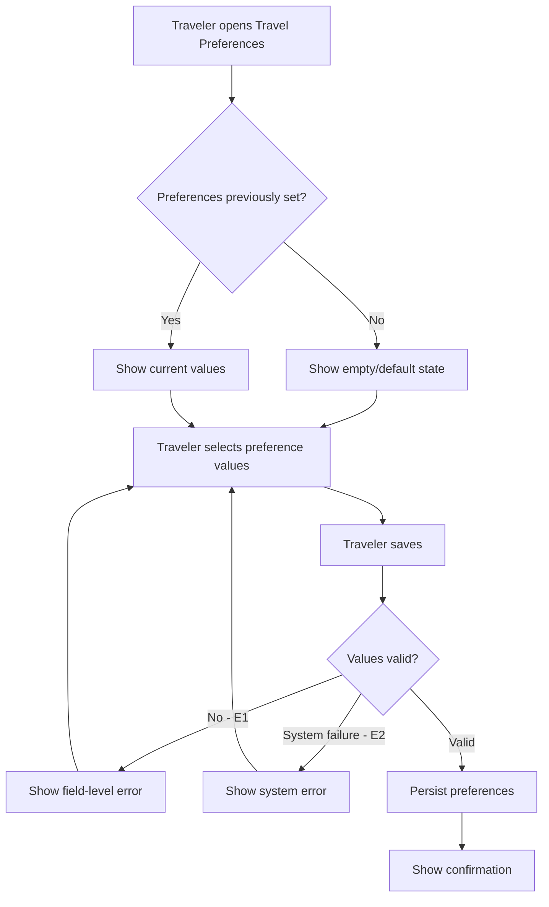

# User Flow Overview

Flow for a Traveler configuring travel preferences (transportation mode, pace, food, interests,
risk tolerance) that later feed into personalized itinerary generation as soft constraints.

# Actor

Traveler (authenticated)

# Entry Point

Travel Preferences settings.

# Primary User Goal

Save preferences so future scheduling requests (UC-10) can use them.

# Main Flow

| Step | User Action | System Action | Next State |
|---|---|---|---|
| 1 | Traveler opens Travel Preferences | Displays current values, or empty/default state if none set | View / Input |
| 2 | Traveler selects values across the five categories | — | Input |
| 3 | Traveler saves | Validates submitted values | Validating |
| 4 | — | On success: persists preferences | Success |

# Alternative Flows

- **AF1 — First-time Traveler (no preferences set):** shown an empty/default state instead of
  pre-filled values.
- **AF2 — Partial update:** Traveler sets/changes only some categories, leaving others as-is.

# Validation Flow

- Each category's value(s) checked against its value domain (placeholder domains — see MVP scope;
  needs confirmation).

# Error Flow

- **E1 — Invalid preference value:** inline field-level error; stays on this screen.
- **E2 — System/save failure:** generic error; preferences unchanged; Traveler can retry.

# Success State

Preferences persisted; Traveler sees a confirmation; values are available to future UC-10
requests and CSP processing.

# Navigation Map

- **Travel Preferences → View/Input → Success → Travel Preferences** (updated values shown)
- **Any error → stays on Travel Preferences (Input)**

# Flow Diagram

# Open Questions

- Confirmed selectable options for each preference category (blocks finalizing this flow's exact
  input controls).
- Can a Traveler explicitly clear a category back to "no preference"?
- Is there a limit on multi-select categories?
