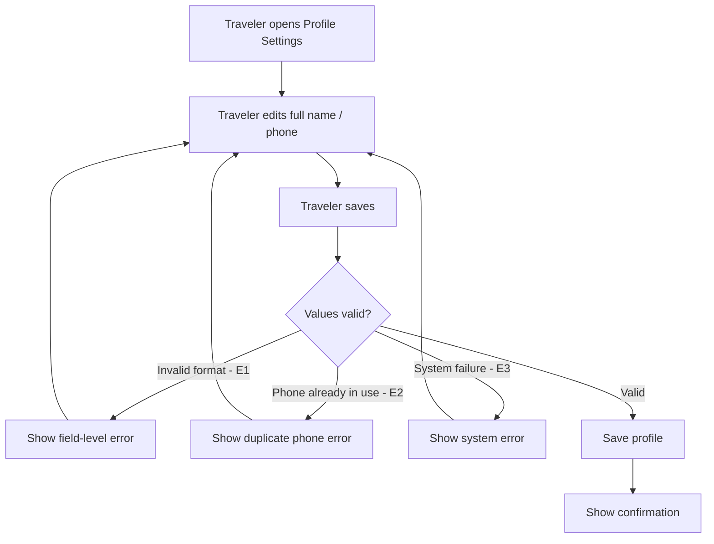

# User Flow Overview

Flow for a Traveler viewing and editing their basic profile info (full name, phone number at
MVP), saving changes in place.

# Actor

Traveler (authenticated)

# Entry Point

Profile Settings.

# Primary User Goal

Update personal profile information and see it saved successfully.

# Main Flow

| Step | User Action | System Action | Next State |
|---|---|---|---|
| 1 | Traveler opens Profile Settings | Displays current profile values | View / Input |
| 2 | Traveler edits one or more fields (full name, phone) | — | Input |
| 3 | Traveler saves | Validates updated values | Validating |
| 4 | — | On success: saves profile | Success |

# Alternative Flows

- **AF1 — Avatar upload:** Should Have, not in this MVP flow diagram.
- **AF2 — Email change:** Could Have, not in this MVP flow diagram (re-verification undecided).

# Validation Flow

- Format checks per field (e.g., phone format).
- Phone uniqueness check against other accounts, if phone is changed.

# Error Flow

- **E1 — Invalid field value:** inline field-level error; stays on this screen.
- **E2 — New phone already in use:** inline error on that field.
- **E3 — System/save failure:** generic error; profile unchanged; Traveler can retry.

# Success State

Profile updated with new values; Traveler sees a confirmation; account role unchanged.

# Navigation Map

- **Profile Settings → View/Input → Success → Profile Settings** (updated values now shown)
- **Any error → stays on Profile Settings (Input)**

# Flow Diagram

# Open Questions

- Does changing email require re-verification (affects whether email editing is even shown at
  MVP)?
- Avatar upload constraints, once in scope.
- Is there a notification when contact info changes?
