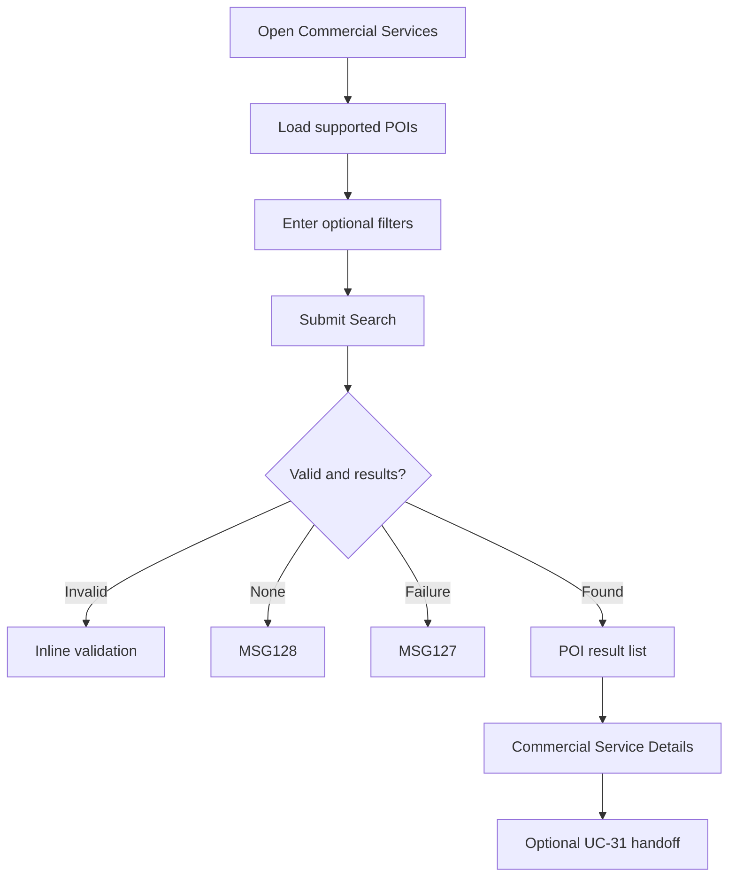

# User Flow Overview

UC-30 searches and displays commercial-service POIs on Flutter Mobile, with a separate handoff to UC-31.

# Actor

Traveler (authenticated)

# Entry Point

Commercial Services navigation or an eligible commercial POI from itinerary/POI catalogue.

# Primary User Goal

Find and inspect a Hotel, Vehicle Rental, or Restaurant POI.

# Main Flow

| Step | User Action | System Action | Next State |
|---|---|---|---|
| 1 | Opens Commercial Services | Loads first 20 active supported-category POIs and total count | List |
| 2 | Enters optional category/location/date-time/price filters | Does not search yet | Criteria Ready |
| 3 | Submits Search | Validates and filters eligible POIs | Results |
| 4 | Selects POI | Preserves list state and loads current stored detail/qualified availability | Details |
| 5 | Selects Book Service where eligible | Navigates to separate UC-31 | UC-31 |

# Alternative Flows

Open details directly from itinerary/POI catalogue; return to preserved search results.

# Validation Flow

Category exactly one of Hotel/Vehicle Rental/Restaurant; active POI; valid price range; truthful availability.

# Error Flow

- Invalid/missing criteria: inline MSG01/field-specific validation.
- No matches: MSG128.
- Retrieval/network failure: MSG127.
- Inactive selected POI: do not present as bookable.
- Unreliable availability: label as unavailable/unconfirmed, not confirmed.
- Expired session: MSG125.

# Success State

Matching POIs or selected POI details are displayed; no commercial Booking exists or changes.

# Navigation Map

Commercial Services Search & List → Commercial Service Details → optional UC-31; Back restores list state.

# Flow Diagram

# Open Questions

No additional service categories or provider concepts are permitted.

