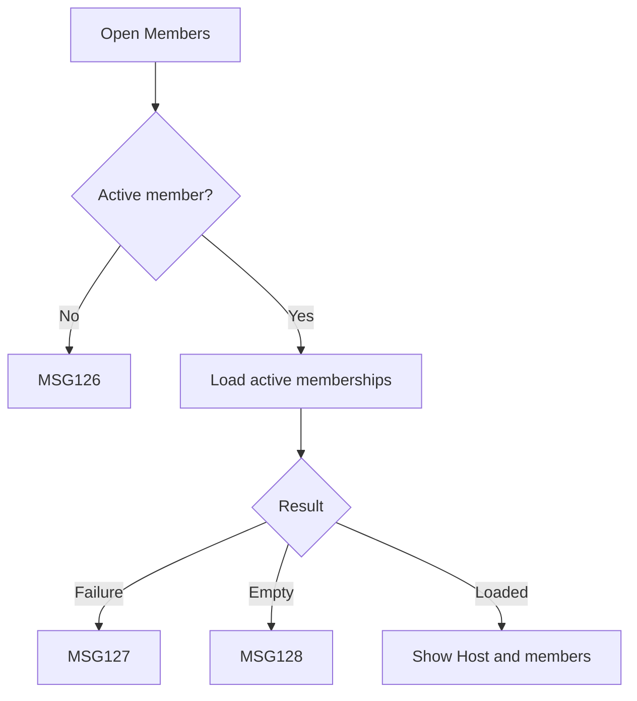

# User Flow Overview

UC-19 displays the active members of a selected travel group with privacy-limited information.

# Actor

Traveler (active group member)

# Entry Point

Travel Group Details & Members → Members.

# Primary User Goal

View current group membership and identify the Host.

# Main Flow

| Step | User Action | System Action | Next State |
|---|---|---|---|
| 1 | Opens Members | Verifies group and active membership | Loading |
| 2 | — | Retrieves active memberships and identifies Host | Loaded |
| 3 | Changes page/filter/sort if available | Returns the requested result while preserving list state | Loaded |

# Alternative Flows

Return from another group detail view with prior page/filter/sort preserved.

# Validation Flow

Group exists; current Traveler is active; only privacy-permitted member information is returned.

# Error Flow

- No longer active: MSG126.
- Retrieval/network failure: MSG127.
- Applicable empty result: MSG128.

# Success State

Current permitted membership list and Host are displayed; no data is modified.

# Navigation Map

Travel Group Details → Members list → group detail actions permitted to the current role.

# Flow Diagram

# Open Questions

Exact permitted profile fields remain governed by the approved privacy rules.

