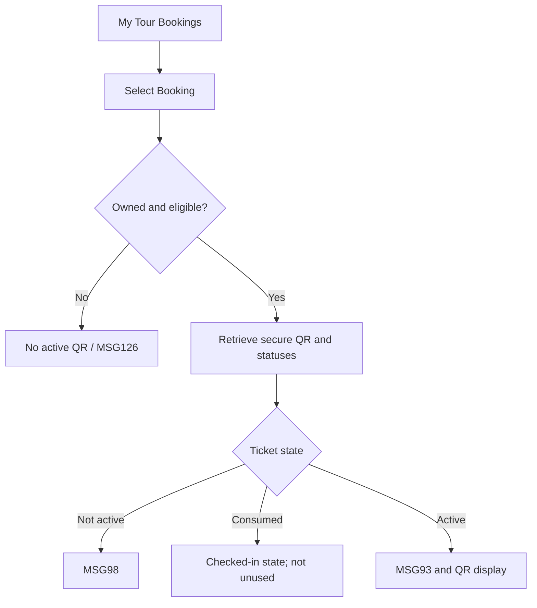

# User Flow Overview

UC-29 displays an eligible Traveler-owned QR e-ticket without scanning or changing check-in state.

# Actor

Traveler (authenticated)

# Entry Point

My Tour Bookings → eligible Booking → View QR E-ticket.

# Primary User Goal

View and present the current QR e-ticket and understand its validity/check-in state.

# Main Flow

| Step | User Action | System Action | Next State |
|---|---|---|---|
| 1 | Selects eligible Booking and View QR E-ticket | Verifies session, ownership, and eligibility | Loading |
| 2 | — | Retrieves secure QR, booking, departure, participant, ticket, and check-in data | Loaded |
| 3 | Presents/views ticket | Makes no Booking or check-in change | Display |

# Alternative Flows

Not-yet-active or already-consumed ticket remains a status display without an unused active QR presentation.

# Validation Flow

Booking exists, belongs to Traveler, is eligible; QR corresponds to Booking and satisfies security requirements.

# Error Flow

- Wrong owner: MSG126.
- Cancelled/ineligible: no active QR.
- Not yet active: MSG98.
- Retrieval/network failure: MSG127.
- Expired session: MSG125.

# Success State

Eligible QR and current ticket/check-in information are displayed; MSG93 where applicable.

# Navigation Map

My Tour Bookings → Booking Details & QR E-ticket → back to My Tour Bookings.

# Flow Diagram

# Open Questions

None.

