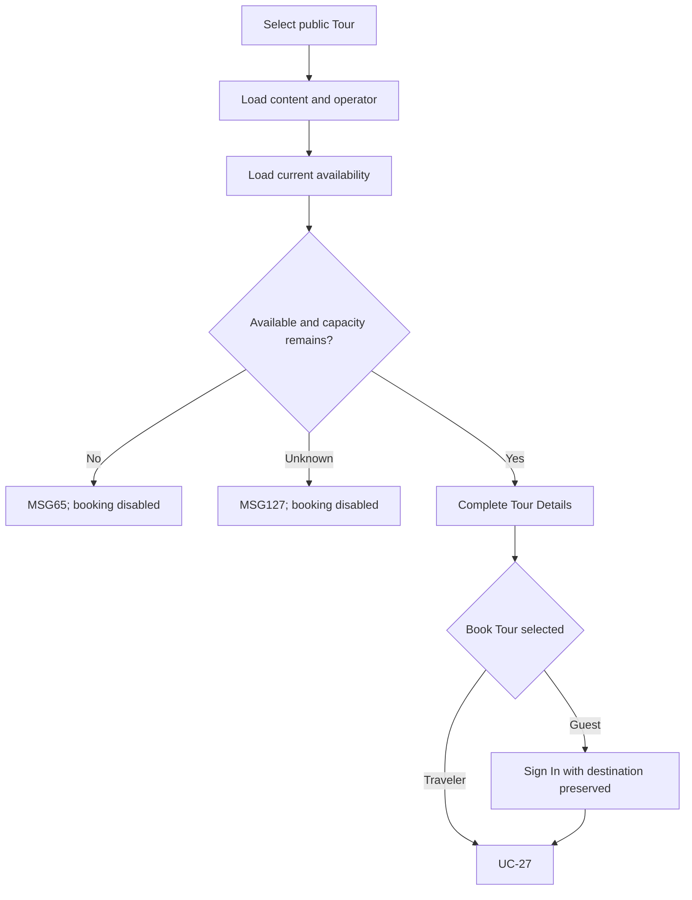

# User Flow Overview

UC-26 shows current public Tour details to Guest or Traveler, with booking gated by eligibility and authentication.

# Actor

Guest / Traveler

# Entry Point

Search Tours, Tour Recommendations, or another supported public Tour entry.

# Primary User Goal

Understand the selected Tour and decide whether to book.

# Main Flow

| Step | User Action | System Action | Next State |
|---|---|---|---|
| 1 | Selects a Tour | Identifies the public Tour and loads content/operator data | Loading |
| 2 | — | Retrieves current departures, remaining capacity, and eligibility | Loaded Details |
| 3 | Traveler selects Book Tour | If eligible, opens UC-27 | Booking |
| 4 | Guest selects Book Tour | Requires Sign In, preserves destination, then continues as Traveler | Authentication → Booking |

# Alternative Flows

Sold-out/unavailable Tour details may remain readable, but booking is disabled and MSG65 is shown.

# Validation Flow

Tour exists, approved/public; current availability retrieved before CTA eligibility.

# Error Flow

- Not public/unavailable/sold out: MSG65; no active booking CTA.
- Availability cannot be confirmed: disable CTA.
- Retrieval/network failure: MSG127.
- Expired Traveler session: MSG125 and preserved booking destination.

# Success State

Complete current Tour information is displayed; viewing changes no Booking.

# Navigation Map

Search/Recommendations → Tour Details → UC-27 or Sign In → UC-27; Back restores source list state.

# Flow Diagram

# Open Questions

None affecting the required detail content.

